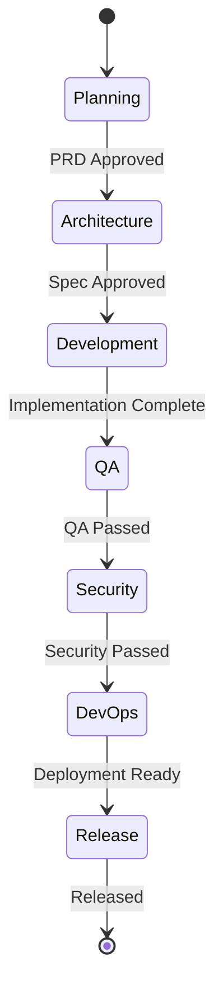

# BMAD Handover Protocol

## Current State

Current Phase

**Release Management**

Active Persona
**[RELEASEMANAGER]**

## Handover History

| Date       | From   | To  | Artifacts | Notes                                                 |
| ---------- | ------ | --- | --------- | ----------------------------------------------------- |
| 2025-11-28 | SYSTEM | PM  | None      | Initial System Reset for Context-Driven Orchestration |

## Artifact Registry

| Artifact ID | Type | Path | Status |
| ----------- | ---- | ---- | ------ |
| -           | -    | -    | -      |

## State Flow

## Active Context

- **Goal:** Implement Context-Driven Orchestration
- **Current Focus:** Initial Planning Phase
- **Blockers:** None

## Metrics

- **Workflow Efficiency:** 100%
- **Error Rate:** 0%
