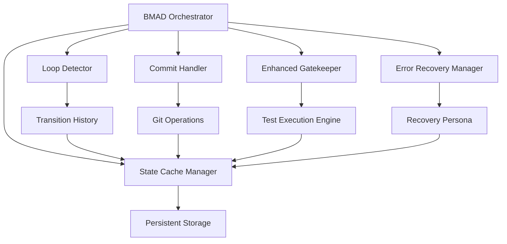

# Design Document

## Overview

This design addresses critical stability issues in the BMAD-GitHub Native Full Cycle system that prevent autonomous operation. The solution implements robust loop detection, reliable commit handling, flexible gatekeeper validation, comprehensive error recovery, and persistent state management to ensure the system can operate continuously without manual intervention.

The design focuses on three core principles:

1. **Resilience**: The system must recover from failures automatically
2. **Determinism**: Behavior must be predictable and testable
3. **Observability**: All operations must be logged and traceable

## Architecture

The enhanced BMAD system introduces several new components that work together to provide robust autonomous operation:



## Components and Interfaces

### Loop Detector

**Purpose**: Prevents infinite loops between personas by tracking transition patterns.

**Interface**:

```javascript
class LoopDetector {
    recordTransition(fromPersona, toPersona, timestamp)
    detectLoop(fromPersona, toPersona) // Returns boolean
    clearHistory() // Called on successful workflow completion
    getTransitionCount(fromPersona, toPersona) // Returns number
}
```

### Enhanced Commit Handler

**Purpose**: Ensures reliable git operations with proper validation and retry logic.

**Interface**:

```javascript
class CommitHandler {
    async prepareCommit(files) // Stages files and validates
    async executeCommit(message, persona, stepId) // Performs commit with retry
    async validateCommit(commitHash) // Verifies commit exists
    formatCommitMessage(persona, stepId, description) // Returns formatted message
}
```

### Enhanced Gatekeeper

**Purpose**: Provides flexible validation with development mode support and robust testing.

**Interface**:

```javascript
class EnhancedGatekeeper {
    async validateWorkflowConditions(context)
    async executeTestSuite()
    async evaluateResults(testResults)
    enableDevelopmentMode(bypass = true)
    generateErrorReport(failures)
}
```

### Error Recovery Manager

**Purpose**: Handles errors across all personas with retry logic and escalation.

**Interface**:

```javascript
class ErrorRecoveryManager {
    async handleError(error, persona, context)
    async retryOperation(operation, maxAttempts = 3)
    async escalateToRecovery(error, context)
    async attemptRemediation(error)
}
```

### State Cache Manager

**Purpose**: Provides persistent, atomic state management across workflow interruptions.

**Interface**:

```javascript
class StateCacheManager {
    async persistState(persona, stepId, context)
    async restoreState()
    async validateState(state)
    async resetToInitial()
    async withAtomicWrite(operation)
}
```

## Data Models

### Workflow State

```javascript
{
    currentPersona: string,
    stepId: string,
    phase: string,
    context: object,
    timestamp: Date,
    retryCount: number,
    transitionHistory: TransitionRecord[]
}
```

### Transition Record

```javascript
{
    fromPersona: string,
    toPersona: string,
    timestamp: Date,
    success: boolean,
    reason: string
}
```

### Error Context

```javascript
{
    persona: string,
    operation: string,
    error: Error,
    timestamp: Date,
    retryCount: number,
    context: object
}
```

### Commit Record

```javascript
{
    hash: string,
    message: string,
    persona: string,
    stepId: string,
    files: string[],
    timestamp: Date
}
```

## Correctness Properties

_A property is a characteristic or behavior that should hold true across all valid executions of a system-essentially, a formal statement about what the system should do. Properties serve as the bridge between human-readable specifications and machine-verifiable correctness guarantees._

### Property 1: Transition Loop Prevention

_For any_ persona transition sequence, when the same transition (fromPersona → toPersona) occurs more than 3 times in a workflow cycle, the system should block further attempts and escalate to recovery.
**Validates: Requirements 1.1, 1.2**

### Property 2: Transition History Persistence

_For any_ persona transition, the system should persist the transition record with timestamp in the state cache for loop detection purposes.
**Validates: Requirements 1.3**

### Property 3: Cache Cleanup on Success

_For any_ successfully completed workflow cycle, the system should clear the transition history cache to prepare for the next cycle.
**Validates: Requirements 1.4**

### Property 4: PM to Architect Validation

_For any_ PM to Architect transition attempt, the system should verify that requirements documentation exists and is complete before allowing the transition.
**Validates: Requirements 1.5**

### Property 5: Commit Staging Validation

_For any_ commit operation, the system should verify that files have been staged using git add before attempting the commit.
**Validates: Requirements 2.1**

### Property 6: Empty Commit Handling

_For any_ commit attempt when no changes are detected, the system should skip the commit operation and log the event without error.
**Validates: Requirements 2.2**

### Property 7: Commit Retry Logic

_For any_ failed commit operation, the system should retry up to 2 times with exponential backoff before giving up.
**Validates: Requirements 2.3**

### Property 8: Commit Message Format

_For any_ executed commit, the message should follow the exact pattern "[PERSONA] [STEP-ID] Description".
**Validates: Requirements 2.4**

### Property 9: Commit Verification

_For any_ commit operation, the system should verify that the commit was successfully created in the git repository.
**Validates: Requirements 2.5**

### Property 10: Gatekeeper Mock Usage

_For any_ gatekeeper evaluation in testing scenarios, the system should use robust mock data to ensure consistent test conditions.
**Validates: Requirements 3.1**

### Property 11: Test Suite Execution

_For any_ validation requiring automated tests, the system should execute the test suite and properly evaluate the results.
**Validates: Requirements 3.2**

### Property 12: Gatekeeper Error Reporting

_For any_ gatekeeper blocking due to test failures, the system should provide detailed error information and suggested remediation steps.
**Validates: Requirements 3.3**

### Property 13: Development Mode Bypass

_For any_ gatekeeper evaluation when development mode is active, the system should provide an optional bypass mechanism.
**Validates: Requirements 3.4**

### Property 14: Gatekeeper Success Logging

_For any_ successful gatekeeper validation, the system should log the validation success and allow workflow continuation.
**Validates: Requirements 3.5**

### Property 15: Persona Error Retry

_For any_ error encountered by any persona, the system should implement retry logic with exponential backoff up to 3 attempts.
**Validates: Requirements 4.1**

### Property 16: Recovery Escalation

_For any_ error where maximum retry attempts are reached, the system should transition to the recovery persona for error handling.
**Validates: Requirements 4.2**

### Property 17: Recovery Persona Activation

_For any_ recovery persona activation, the system should log the error context and attempt automated remediation.
**Validates: Requirements 4.3**

### Property 18: Remediation Failure Handling

_For any_ failed automated remediation, the system should create a detailed error report and pause workflow execution.
**Validates: Requirements 4.4**

### Property 19: State Restoration After Recovery

_For any_ workflow resumption after error recovery, the system should restore the previous state and continue from the last successful step.
**Validates: Requirements 4.5**

### Property 20: State Persistence

_For any_ workflow state change, the system should persist the current persona, step ID, and context information in the state cache.
**Validates: Requirements 5.1**

### Property 21: State Restoration on Restart

_For any_ system restart after interruption, the system should restore the last known state from the state cache.
**Validates: Requirements 5.2**

### Property 22: State Validation

_For any_ state restoration, the system should validate that the restored state is consistent and actionable.
**Validates: Requirements 5.3**

### Property 23: Invalid State Fallback

_For any_ state validation failure, the system should reset to the initial orchestrator state and log the inconsistency.
**Validates: Requirements 5.4**

### Property 24: Atomic State Operations

_For any_ state persistence operation, the system should ensure atomic write operations to prevent corruption.
**Validates: Requirements 5.5**

## Error Handling

The system implements a multi-layered error handling strategy:

1. **Immediate Retry**: Operations retry up to 3 times with exponential backoff
2. **Persona-Level Recovery**: Each persona has specific error recovery procedures
3. **System-Level Recovery**: Recovery persona handles complex error scenarios
4. **Circuit Breaker**: System pauses after repeated failures to prevent damage
5. **Graceful Degradation**: Non-critical features can be disabled to maintain core functionality

### Error Categories

- **Transient Errors**: Network issues, temporary file locks, API rate limits
- **Configuration Errors**: Missing environment variables, invalid settings
- **Logic Errors**: Infinite loops, invalid state transitions
- **External Errors**: GitHub API failures, git command failures
- **System Errors**: Disk space, memory issues, permission problems

## Testing Strategy

The testing approach combines unit testing and property-based testing to ensure comprehensive coverage:

### Unit Testing

- Test specific error scenarios and edge cases
- Validate individual component behavior
- Test integration points between components
- Mock external dependencies (GitHub API, git commands)

### Property-Based Testing

- **Framework**: fast-check for JavaScript property-based testing
- **Iterations**: Minimum 100 iterations per property test
- **Coverage**: All 24 correctness properties must be implemented as property-based tests
- **Tagging**: Each test tagged with format: `**Feature: bmad-critical-fixes, Property {number}: {property_text}**`

### Test Configuration

```javascript
// jest.config.js additions for property testing
module.exports = {
  testEnvironment: 'node',
  coverageThreshold: {
    global: {
      branches: 90,
      functions: 90,
      lines: 90,
      statements: 90,
    },
  },
  setupFilesAfterEnv: ['<rootDir>/tests/setup-property-tests.js'],
};
```

### Mock Strategy

- **GitHub API**: Use @octokit/rest mocks for consistent testing
- **Git Operations**: Mock git commands to avoid repository pollution
- **File System**: Use in-memory file system for isolated testing
- **Time**: Mock Date/setTimeout for deterministic timing tests
