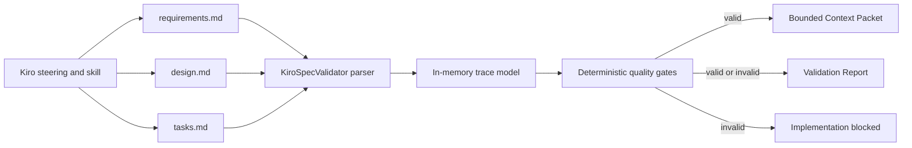

# Design Document: Deterministic Kiro Specification Validation

## Overview

The implementation adds a deterministic quality layer around Kiro-native Markdown specifications. It does not replace Kiro's format and does not introduce a competing canonical schema. Instead, it parses the three canonical Markdown files into an in-memory model, applies objective invariants, produces reports, and projects a bounded context packet for an individual task.

The design targets a central constraint: models with limited parameters or context windows must not be responsible for remembering global traceability, detecting dependency cycles, or deciding whether a specification is complete. Those responsibilities belong to deterministic code.

## Architecture



## Components and Interfaces

### KiroSpecValidator

**Location:** `scripts/lib/kiro-spec-validator.js`

Responsibilities:

- Load the canonical trio without mutating it
- Parse requirements, acceptance criteria, properties, tasks, and dependencies
- Validate structural, traceability, coverage, status, and graph invariants
- Calculate metrics and a canonical SHA-256 fingerprint
- Generate a bounded Context_Packet only from a valid specification

Public interface:

```javascript
const validator = new KiroSpecValidator({ strict: true });

const report = validator.validate('.kiro/specs/example');
const packet = validator.contextPacket('.kiro/specs/example', '2.3');
```

### Specification CLI

**Location:** `scripts/kiro-spec.js`

Commands:

- `init <spec-name>` creates missing canonical files without overwriting existing files
- `validate <spec-dir>` prints a human or JSON report and sets a deterministic exit code
- `context <spec-dir> <task-id>` emits a bounded JSON packet after successful validation

Atomic writes use a process-specific temporary file followed by rename.

### BMAD CLI and npm Integration

**Locations:** `bin/bmad-cli.js` and `package.json`

The public command surfaces delegate to the specification CLI. They do not duplicate parsing or validation logic.

### Kiro Guidance

**Locations:**

- `.kiro/steering/spec-quality.md`
- `.kiro/skills/bmad-kiro-spec/SKILL.md`
- `.agents/skills/bmad-kiro-spec/SKILL.md`

The Kiro-facing files preserve native discovery while the agent-facing adapter directs other environments to the same canonical workflow.

## Data Models

### Validation Report

```javascript
{
  valid: boolean,
  specDir: string,
  errors: ValidationFinding[],
  warnings: ValidationFinding[],
  metrics: {
    requirements: number,
    acceptanceCriteria: number,
    properties: number,
    tasks: number,
    completedTasks: number,
    traceCoveragePercent: number
  },
  fingerprint: string
}
```

### Context Packet

```javascript
{
  schemaVersion: 1,
  fingerprint: string,
  task: Task,
  requirements: AcceptanceCriterion[],
  properties: CorrectnessProperty[],
  dependencies: TaskSummary[],
  deterministicInstructions: string[]
}
```

## Error Handling

- Missing canonical files produce findings rather than filesystem exceptions.
- Invalid specs cannot produce context packets.
- Unknown task IDs fail explicitly.
- CLI exceptions set a non-zero process exit code.
- Reports exclude the internal parsed model to keep the external contract bounded.
- Existing canonical files are never overwritten by initialization.

## Security and Integrity

- Spec names are restricted to lowercase kebab-case to prevent path traversal through initialization.
- All target paths are resolved before access.
- Derived report writes are atomic.
- SHA-256 fingerprints bind packets and reports to the exact canonical input state.
- The implementation performs no network calls and executes no content from Markdown.

## Testing Strategy

The Jest suite uses isolated temporary directories and covers:

- Acceptance of a complete Kiro-compatible spec
- Missing canonical files
- Unknown references, uncovered criteria, and properties without tests
- Optional quality-critical tasks
- Dependency cycles
- Bounded packet construction

An end-to-end smoke test exercises BMAD CLI initialization, validation, and context generation in a temporary directory.

## Correctness Properties

### Property 1: Canonical trio initialization

_For any_ valid kebab-case spec name, initialization creates every missing canonical Kiro file under the expected spec directory and preserves every existing canonical file.

**Validates: Requirements 1.1, 1.2, 1.3, 1.4**

### Property 2: Markdown remains canonical

_For any_ report or context packet, its content is derived from the current canonical trio and never overrides the Markdown source.

**Validates: Requirements 1.5**

### Property 3: Stable requirement parsing

_For any_ supported Kiro requirements document, each numbered acceptance criterion receives exactly one stable requirement-and-criterion ID.

**Validates: Requirements 2.1, 2.4, 2.5**

### Property 4: Stable design parsing

_For any_ supported Kiro design document, each correctness property and its exact requirement references are reconstructed without LLM interpretation.

**Validates: Requirements 2.2, 2.4, 2.5**

### Property 5: Stable task parsing

_For any_ supported Kiro task document, checkbox state, hierarchy, optionality, traces, properties, and dependencies are reconstructed deterministically.

**Validates: Requirements 2.3, 2.5, 4.1**

### Property 6: Structural failures are rejected

_For any_ spec with missing files, empty files, placeholders, or requirements without criteria, validation returns invalid with attributable findings.

**Validates: Requirements 3.1, 3.2, 3.3**

### Property 7: Unknown traces are rejected

_For any_ property or task reference, validation succeeds only if the referenced acceptance criterion or correctness property exists.

**Validates: Requirements 3.4, 3.5**

### Property 8: Coverage is complete

_For any_ valid spec, every acceptance criterion has a traced task and every correctness property has an explicit verification task.

**Validates: Requirements 3.6, 3.7, 3.10**

### Property 9: Quality tasks are mandatory

_For any_ strict validation run, a quality-critical optional task makes the specification invalid.

**Validates: Requirements 3.8**

### Property 10: Hierarchical status is consistent

_For any_ task with required direct children, the parent completion state equals the conjunction of those child states.

**Validates: Requirements 3.9**

### Property 11: Dependency references are valid

_For any_ declared task dependency, validation rejects missing targets and self-dependencies while preserving valid targets.

**Validates: Requirements 4.2, 4.3, 4.5**

### Property 12: Dependency graph is acyclic

_For any_ task graph, validation rejects the graph if and only if depth-first traversal discovers a dependency cycle.

**Validates: Requirements 4.4**

### Property 13: Invalid specs cannot create packets

_For any_ invalid specification or unknown task, Context_Packet generation fails before returning implementation context.

**Validates: Requirements 5.1, 5.2**

### Property 14: Context packets are bounded and traced

_For any_ task in a valid spec, the Context_Packet contains the selected task and only its traced criteria, relevant properties, and declared dependencies.

**Validates: Requirements 5.3, 5.4**

### Property 15: Fingerprints bind canonical state

_For any_ unchanged canonical trio, repeated fingerprint generation is identical, and any content change changes the fingerprint with SHA-256 collision resistance.

**Validates: Requirements 5.5**

### Property 16: Command surfaces preserve deterministic behavior

_For any_ supported npm or BMAD CLI command, execution delegates to the same specification CLI and preserves machine-readable output and exit semantics.

**Validates: Requirements 6.1, 6.2, 6.3**

### Property 17: Derived reports are atomic

_For any_ report write, observers see either the previous complete report or the new complete report, never a partial file.

**Validates: Requirements 6.4**

### Property 18: Kiro receives deterministic workflow guidance

_For any_ Kiro session in this project, the installed steering and skill files describe the canonical trio, mandatory validation gate, and bounded-context execution workflow.

**Validates: Requirements 6.5**
