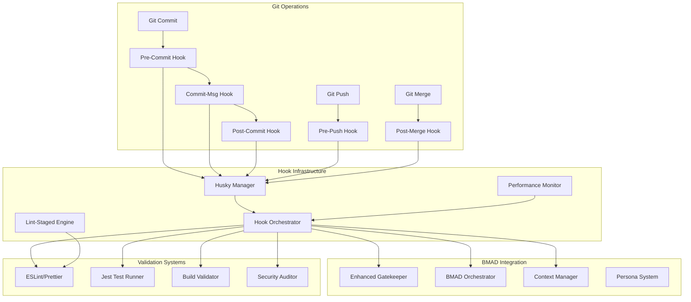

# Git Hooks Automation Design Document

## Overview

The Git Hooks Automation system provides comprehensive, performance-optimized automation for the BMAD-GitHub Native Full Cycle project. This system implements five critical Git hooks (pre-commit, commit-msg, pre-push, post-commit, post-merge) plus additional lifecycle hooks to achieve zero manual intervention while maintaining code quality, BMAD compliance, and seamless integration with existing infrastructure.

The design leverages Husky for Git hooks management, lint-staged for performance optimization, and integrates deeply with the Enhanced Gatekeeper, BMAD personas, and existing workflow scripts to create a unified automation experience.

## Architecture

### High-Level Architecture



### Component Interaction Flow

1. **Git Operation Trigger**: Developer performs Git operation
2. **Hook Activation**: Husky activates appropriate hook script
3. **Orchestration**: Hook Orchestrator coordinates validation pipeline
4. **BMAD Integration**: Enhanced Gatekeeper validates BMAD compliance
5. **Quality Checks**: Parallel execution of linting, testing, and validation
6. **Context Updates**: Context Manager maintains activeContext.md
7. **Workflow Integration**: BMAD Orchestrator handles persona transitions

## Components and Interfaces

### Core Components

#### 1. Hook Orchestrator

**Purpose**: Central coordination of all hook operations
**Location**: `scripts/hooks/hook-orchestrator.js`

```javascript
class HookOrchestrator {
  constructor(config) {
    this.config = config;
    this.gatekeeper = new EnhancedGatekeeper();
    this.contextManager = new ContextManager();
    this.logger = new Logger('HookOrchestrator');
  }

  async executePreCommit(stagedFiles) {
    /* Implementation */
  }
  async executeCommitMsg(message) {
    /* Implementation */
  }
  async executePrePush(branch, remote) {
    /* Implementation */
  }
  async executePostCommit(commitHash) {
    /* Implementation */
  }
  async executePostMerge(mergeType) {
    /* Implementation */
  }
}
```

#### 2. BMAD Message Validator

**Purpose**: Validates commit messages against BMAD patterns
**Location**: `scripts/hooks/bmad-message-validator.js`

```javascript
class BMADMessageValidator {
  validateBMADPattern(message) {
    // Pattern: [PERSONA] [STEP-ID] Description
    const bmadRegex = /^\[([A-Z_]+)\] \[([A-Z]+-\d+)\] .+/;
    return bmadRegex.test(message);
  }

  validateConventionalCommits(message) {
    // Support conventional commits as fallback
    const conventionalRegex =
      /^(feat|fix|docs|style|refactor|perf|test|build|ci|chore|revert)(\([\w-]+\))?: .+/;
    return conventionalRegex.test(message);
  }
}
```

#### 3. Performance Monitor

**Purpose**: Tracks hook execution performance and optimization
**Location**: `scripts/hooks/performance-monitor.js`

```javascript
class PerformanceMonitor {
  startTimer(hookName) {
    /* Implementation */
  }
  endTimer(hookName) {
    /* Implementation */
  }
  getMetrics() {
    /* Implementation */
  }
  optimizeExecution(hookName, metrics) {
    /* Implementation */
  }
}
```

#### 4. Context Synchronizer

**Purpose**: Manages activeContext.md updates and BMAD state
**Location**: `scripts/hooks/context-synchronizer.js`

```javascript
class ContextSynchronizer {
  async updateActiveContext(commitInfo) {
    /* Implementation */
  }
  async syncPersonaState(persona, stepId) {
    /* Implementation */
  }
  async validateContextConsistency() {
    /* Implementation */
  }
}
```

### Integration Interfaces

#### Enhanced Gatekeeper Integration

```javascript
// Existing Enhanced Gatekeeper will be extended with hook-specific methods
class EnhancedGatekeeper {
  async validateHookContext(hookType, context) {
    /* New method */
  }
  async generateHookReport(results) {
    /* New method */
  }
}
```

#### BMAD Orchestrator Integration

```javascript
// Existing BMAD Orchestrator will receive hook notifications
class BMADOrchestrator {
  async onHookExecution(hookType, result) {
    /* New method */
  }
  async triggerWorkflowFromHook(context) {
    /* New method */
  }
}
```

## Data Models

### Hook Configuration Model

```javascript
const HookConfig = {
  preCommit: {
    enabled: true,
    linting: { enabled: true, fix: true },
    testing: { enabled: true, fast: true },
    contextValidation: { enabled: true, required: true },
    gatekeeper: { enabled: true, strict: false },
  },
  commitMsg: {
    enabled: true,
    bmadPattern: { enabled: true, strict: true },
    conventionalCommits: { enabled: true, fallback: true },
  },
  prePush: {
    enabled: true,
    fullTests: { enabled: true, coverage: true },
    build: { enabled: true, validate: true },
    security: { enabled: true, audit: true },
    bmadSync: { enabled: true },
  },
  postCommit: {
    enabled: true,
    metrics: { enabled: true },
    documentation: { enabled: true, auto: true },
    notifications: { enabled: true },
    contextUpdate: { enabled: true, auto: true },
  },
  postMerge: {
    enabled: true,
    workflow: { enabled: true, full: true },
    validation: { enabled: true },
    reporting: { enabled: true },
    personaSync: { enabled: true },
  },
};
```

### Hook Execution Result Model

```javascript
const HookResult = {
  hookType: 'pre-commit',
  timestamp: '2024-01-01T00:00:00Z',
  duration: 1500, // milliseconds
  status: 'success', // success, failure, warning
  validations: [
    {
      name: 'linting',
      status: 'passed',
      duration: 500,
      details: { filesProcessed: 5, issuesFixed: 2 },
    },
  ],
  errors: [],
  warnings: [],
  metrics: {
    filesProcessed: 10,
    testsRun: 25,
    coveragePercent: 85.5,
  },
  bmadContext: {
    persona: 'DEVELOPER',
    stepId: 'STEP-001',
    workflowPhase: 'implementation',
  },
};
```

### Performance Metrics Model

```javascript
const PerformanceMetrics = {
  hookName: 'pre-commit',
  executions: [
    {
      timestamp: '2024-01-01T00:00:00Z',
      duration: 1500,
      filesCount: 10,
      testsCount: 25,
      success: true,
    },
  ],
  averageDuration: 1200,
  p95Duration: 2000,
  successRate: 0.98,
  optimizations: [
    'lint-staged enabled',
    'parallel test execution',
    'incremental builds',
  ],
};
```

## Correctness Properties

_A property is a characteristic or behavior that should hold true across all valid executions of a system-essentially, a formal statement about what the system should do. Properties serve as the bridge between human-readable specifications and machine-verifiable correctness guarantees._

<function_calls>
<invoke name="prework">
<parameter name="featureName">git-hooks-automation

After reviewing the prework analysis, I need to perform property reflection to eliminate redundancy and consolidate related properties:

**Property Reflection:**

- Properties 1.2 and 2.1 are identical (BMAD pattern validation) - consolidate into one
- Properties 1.5 and 7.1 are identical (Enhanced Gatekeeper integration) - consolidate into one
- Several properties can be grouped by hook type for better organization
- Performance properties (8.1-8.5) can be consolidated into fewer, more comprehensive properties
- Error handling properties can be combined where they address similar scenarios

**Property 1: Pre-commit lint and format execution**
_For any_ set of staged files, when a commit is attempted, the system should execute lint and format operations on exactly those staged files
**Validates: Requirements 1.1**

**Property 2: BMAD commit message validation**
_For any_ commit message, the system should accept it if and only if it matches the BMAD pattern [PERSONA] [STEP-ID] Description or conventional commit format
**Validates: Requirements 1.2, 2.1, 2.3**

**Property 3: Pre-commit test execution**
_For any_ commit attempt, when pre-commit validation runs, the system should execute the fast unit test suite and report results
**Validates: Requirements 1.3**

**Property 4: Context validation consistency**
_For any_ commit with code changes, when activeContext.md exists, the system should verify context updates and reject commits lacking proper context updates
**Validates: Requirements 1.4, 2.4**

**Property 5: Enhanced Gatekeeper integration**
_For any_ validation process, when Enhanced Gatekeeper is available, the system should integrate validation through the gatekeeper system and maintain synchronization
**Validates: Requirements 1.5, 7.1**

**Property 6: Commit rejection with clear errors**
_For any_ invalid commit message or validation failure, the system should prevent the commit and display clear, actionable error messages
**Validates: Requirements 2.2**

**Property 7: Pre-push comprehensive validation**
_For any_ push operation, the system should execute the complete test suite with coverage, build validation, and security audit before allowing the push
**Validates: Requirements 3.1, 3.2, 3.3**

**Property 8: BMAD workflow synchronization**
_For any_ active BMAD workflow, the system should synchronize validation requirements and coordinate with existing BMAD scripts and processes
**Validates: Requirements 3.4, 7.4**

**Property 9: Validation failure prevention**
_For any_ validation failure during pre-push, the system should prevent the push and provide detailed failure reports with remediation guidance
**Validates: Requirements 3.5**

**Property 10: Post-commit automation**
_For any_ successful commit, the system should automatically update project metrics, regenerate documentation when needed, and register the commit in active context
**Validates: Requirements 4.1, 4.2, 4.4**

**Property 11: BMAD orchestrator notifications**
_For any_ condition requiring BMAD orchestrator notification, the system should send appropriate signals without blocking the commit process
**Validates: Requirements 4.3**

**Property 12: Non-blocking error handling**
_For any_ post-commit action failure, the system should log detailed errors without blocking the commit process
**Validates: Requirements 4.5**

**Property 13: Post-merge workflow execution**
_For any_ completed merge, the system should execute the complete bmad:workflow process and generate comprehensive merge analysis reports
**Validates: Requirements 5.1, 5.3**

**Property 14: Repository state validation**
_For any_ merge or integration operation, when repository state validation is needed, the system should verify the repository remains in a valid state
**Validates: Requirements 5.2**

**Property 15: Persona context synchronization**
_For any_ persona transition or context update requirement, the system should update all relevant persona contexts and maintain consistency across BMAD components
**Validates: Requirements 5.4, 7.3**

**Property 16: Integration failure recovery**
_For any_ integration workflow failure, the system should provide rollback recommendations and detailed troubleshooting information
**Validates: Requirements 5.5**

**Property 17: Lifecycle hook validation**
_For any_ rebase operation or branch checkout, the system should validate safety/compatibility and restore appropriate BMAD context respectively
**Validates: Requirements 6.1, 6.2**

**Property 18: Server-side validation capability**
_For any_ server-side validation requirement, the system should provide pre-receive hooks for final validation
**Validates: Requirements 6.3**

**Property 19: Development mode bypass controls**
_For any_ development mode activation, the system should provide controlled bypass mechanisms while maintaining detailed logging for troubleshooting
**Validates: Requirements 6.4, 6.5**

**Property 20: GitHub Actions consistency**
_For any_ configured GitHub Actions, the system should maintain consistency between local and remote validation processes
**Validates: Requirements 7.2**

**Property 21: Performance optimization**
_For any_ hook execution, the system should use Husky and lint-staged for optimal performance and complete within reasonable time limits for developer productivity
**Validates: Requirements 8.1, 8.5**

**Property 22: Optimized execution**
_For any_ shell script execution or logging operation, the system should use optimized implementations that provide detailed information without impacting performance
**Validates: Requirements 8.2, 8.3**

**Property 23: Development workflow bypass**
_For any_ development workflow execution, the system should provide bypass controls for rapid iteration while maintaining audit trails
**Validates: Requirements 8.4**

## Error Handling

### Error Classification System

The system implements a comprehensive error classification to provide appropriate responses:

1. **Blocking Errors** (Prevent operation completion)
   - Invalid commit message format
   - Test failures
   - Build failures
   - Security vulnerabilities

2. **Warning Errors** (Allow operation with warnings)
   - Missing context updates (with bypass option)
   - Performance threshold exceeded
   - Non-critical dependency issues

3. **Non-blocking Errors** (Log but don't prevent operation)
   - Post-commit notification failures
   - Documentation generation issues
   - Metrics update failures

### Error Recovery Mechanisms

#### Automatic Recovery

- **Lint Issues**: Auto-fix with prettier/eslint --fix
- **Context Updates**: Auto-generate basic context entries
- **Performance Issues**: Auto-enable optimizations (lint-staged, parallel execution)

#### Manual Recovery Guidance

- **Test Failures**: Provide specific test output and suggested fixes
- **Build Failures**: Show build logs with highlighted errors
- **Security Issues**: Display npm audit results with upgrade recommendations

#### Bypass Mechanisms

- **Development Mode**: Controlled bypass with audit trail
- **Emergency Override**: Temporary bypass with mandatory follow-up
- **Staged Rollout**: Gradual enablement of strict validation

### Integration with Enhanced Gatekeeper

The system extends the existing Enhanced Gatekeeper error handling:

```javascript
class HookErrorHandler extends EnhancedGatekeeper {
  async handleHookError(hookType, error, context) {
    const classification = this.classifyError(error);
    const recovery = await this.attemptRecovery(error, context);

    if (recovery.successful) {
      return this.logRecovery(hookType, error, recovery);
    }

    return this.generateErrorReport(hookType, error, classification);
  }
}
```

## Testing Strategy

### Dual Testing Approach

The Git Hooks Automation system requires both unit testing and property-based testing to ensure comprehensive coverage:

**Unit Testing Requirements:**

- Test specific hook scenarios and edge cases
- Verify integration points with Enhanced Gatekeeper
- Test error handling and recovery mechanisms
- Validate configuration loading and validation
- Test performance monitoring and optimization

**Property-Based Testing Requirements:**

- Use **fast-check** as the property-based testing library for JavaScript
- Configure each property-based test to run a minimum of 100 iterations
- Each property-based test must be tagged with a comment explicitly referencing the correctness property from this design document
- Tag format: `**Feature: git-hooks-automation, Property {number}: {property_text}**`
- Each correctness property must be implemented by a single property-based test

**Testing Framework Integration:**

- Extend existing Jest configuration for hook testing
- Use supertest for integration testing with Express endpoints
- Implement custom test utilities for Git operation simulation
- Create mock implementations for external dependencies (GitHub API, file system operations)

**Performance Testing:**

- Benchmark hook execution times under various load conditions
- Test parallel execution capabilities
- Validate optimization effectiveness (lint-staged, incremental builds)
- Monitor memory usage during hook execution

**Integration Testing:**

- Test complete hook workflows end-to-end
- Verify BMAD persona integration
- Test GitHub Actions consistency
- Validate Enhanced Gatekeeper integration

The testing strategy ensures that both concrete examples (unit tests) and universal properties (property-based tests) are verified, providing comprehensive coverage of the Git hooks automation system's correctness and performance requirements.
