# Enhanced System Map

## Semantic Context
### Esta função usa uma validação "preguiçosa" para economizar recursos.
- **File:** `docs/en/planning/RFC-001-AgentDoc.md`
- **Line:** 32

### Architect Persona - System design and technical decisions
- **File:** `personas/architect.js`
- **Line:** 1

### Design system architecture based on requirements
- **File:** `personas/architect.js`
- **Line:** 13

### Create comprehensive architecture design
- **File:** `personas/architect.js`
- **Line:** 55

### Create implementation issue for developers
- **File:** `personas/architect.js`
- **Line:** 170

### Enhanced Base class for all BMAD personas with advanced features
- **File:** `personas/base-persona-enhanced.js`
- **Line:** 1

### Load project context from files with enhanced error handling
- **File:** `personas/base-persona-enhanced.js`
- **Line:** 26

### Safe file reading with fallback
- **File:** `personas/base-persona-enhanced.js`
- **Line:** 49

### Enhanced logging with timestamps and metrics
- **File:** `personas/base-persona-enhanced.js`
- **Line:** 60

### Append to log file
- **File:** `personas/base-persona-enhanced.js`
- **Line:** 72

### Create GitHub issue with enhanced metadata
- **File:** `personas/base-persona-enhanced.js`
- **Line:** 89

### Enhanced commit with automatic metrics tracking and validation
- **File:** `personas/base-persona-enhanced.js`
- **Line:** 112

### Execute shell command with error handling
- **File:** `personas/base-persona-enhanced.js`
- **Line:** 170

### Get next step ID for commits
- **File:** `personas/base-persona-enhanced.js`
- **Line:** 186

### Update handover state
- **File:** `personas/base-persona-enhanced.js`
- **Line:** 194

### Generate handover content
- **File:** `personas/base-persona-enhanced.js`
- **Line:** 208

### Validate prerequisites for persona execution
- **File:** `personas/base-persona-enhanced.js`
- **Line:** 246

### Get persona execution summary
- **File:** `personas/base-persona-enhanced.js`
- **Line:** 260

### Base class for all BMAD personas
- **File:** `personas/base-persona.js`
- **Line:** 1

### Load project context from files
- **File:** `personas/base-persona.js`
- **Line:** 19

### Update active context with current work
- **File:** `personas/base-persona.js`
- **Line:** 33

### Create micro-commit with tracking ID
- **File:** `personas/base-persona.js`
- **Line:** 56

### Create GitHub issue for task tracking
- **File:** `personas/base-persona.js`
- **Line:** 99

### Abstract method for persona execution
- **File:** `personas/base-persona.js`
- **Line:** 120

### Log persona activity
- **File:** `personas/base-persona.js`
- **Line:** 127

### Enhanced Developer Persona with advanced code generation and validation
- **File:** `personas/developer-enhanced.js`
- **Line:** 1

### Detect project tech stack from configuration files
- **File:** `personas/developer-enhanced.js`
- **Line:** 21

### Enhanced implementation with code quality checks
- **File:** `personas/developer-enhanced.js`
- **Line:** 64

### Parse implementation requirements from issue body
- **File:** `personas/developer-enhanced.js`
- **Line:** 121

### Generate detailed implementation plan
- **File:** `personas/developer-enhanced.js`
- **Line:** 155

### Generate setup tasks based on requirements
- **File:** `personas/developer-enhanced.js`
- **Line:** 187

### Generate core implementation tasks
- **File:** `personas/developer-enhanced.js`
- **Line:** 224

### Generate testing tasks
- **File:** `personas/developer-enhanced.js`
- **Line:** 241

### Generate documentation tasks
- **File:** `personas/developer-enhanced.js`
- **Line:** 258

### Execute implementation phase
- **File:** `personas/developer-enhanced.js`
- **Line:** 276

### Execute individual task
- **File:** `personas/developer-enhanced.js`
- **Line:** 299

### Create file based on tech stack
- **File:** `personas/developer-enhanced.js`
- **Line:** 328

### Generate file content based on path and tech stack
- **File:** `personas/developer-enhanced.js`
- **Line:** 338

### Implement feature based on requirements
- **File:** `personas/developer-enhanced.js`
- **Line:** 380

### Generate feature code
- **File:** `personas/developer-enhanced.js`
- **Line:** 394

### Create test file
- **File:** `personas/developer-enhanced.js`
- **Line:** 436

### Generate test code
- **File:** `personas/developer-enhanced.js`
- **Line:** 450

### Create documentation
- **File:** `personas/developer-enhanced.js`
- **Line:** 482

### Generate documentation content
- **File:** `personas/developer-enhanced.js`
- **Line:** 493

### Run quality checks on implemented code
- **File:** `personas/developer-enhanced.js`
- **Line:** 551

### Generate implementation report
- **File:** `personas/developer-enhanced.js`
- **Line:** 582

### Developer Persona - Code implementation and feature development
- **File:** `personas/developer.js`
- **Line:** 1

### Implement features based on architecture design
- **File:** `personas/developer.js`
- **Line:** 15

### Implement core application structure
- **File:** `personas/developer.js`
- **Line:** 82

### Implement API endpoints
- **File:** `personas/developer.js`
- **Line:** 98

### Implement GitHub integration
- **File:** `personas/developer.js`
- **Line:** 106

### Create test suite
- **File:** `personas/developer.js`
- **Line:** 114

### Get Express app configuration
- **File:** `personas/developer.js`
- **Line:** 122

### Get configuration module
- **File:** `personas/developer.js`
- **Line:** 175

### Get GitHub service implementation
- **File:** `personas/developer.js`
- **Line:** 209

### Get persona controller implementation
- **File:** `personas/developer.js`
- **Line:** 307

### Get integration tests
- **File:** `personas/developer.js`
- **Line:** 376

### Create QA review issue
- **File:** `personas/developer.js`
- **Line:** 420

### DevOps Persona - Infrastructure and deployment preparation
- **File:** `personas/devops.js`
- **Line:** 1

### Project Manager Persona - Planning and requirements definition
- **File:** `personas/project-manager.js`
- **Line:** 1

### Analyze GitHub issue and create work plan
- **File:** `personas/project-manager.js`
- **Line:** 13

### Create structured work plan from issue
- **File:** `personas/project-manager.js`
- **Line:** 56

### Create architecture planning issue
- **File:** `personas/project-manager.js`
- **Line:** 105

### QA Persona - Testing and quality assurance
- **File:** `personas/qa.js`
- **Line:** 1

### Release Manager Persona - Version management and release coordination
- **File:** `personas/release-manager.js`
- **Line:** 1

### Generate changelog preview using git log
- **File:** `personas/release-manager.js`
- **Line:** 73

### Push git tag to trigger release workflow
- **File:** `personas/release-manager.js`
- **Line:** 86

### Security Persona - Security analysis and compliance
- **File:** `personas/security.js`
- **Line:** 1

### Enhanced Agent Documentation Generator with advanced semantic analysis
- **File:** `scripts/bmad/agent-doc-enhanced.js`
- **Line:** 1

### Extract semantic tags from all files in the codebase
- **File:** `scripts/bmad/agent-doc-enhanced.js`
- **Line:** 41

### Get all code files from the project
- **File:** `scripts/bmad/agent-doc-enhanced.js`
- **Line:** 72

### Extract tags from a single file
- **File:** `scripts/bmad/agent-doc-enhanced.js`
- **Line:** 101

### Get line number from character index
- **File:** `scripts/bmad/agent-doc-enhanced.js`
- **Line:** 154

### Generate comprehensive documentation
- **File:** `scripts/bmad/agent-doc-enhanced.js`
- **Line:** 162

### Generate project overview
- **File:** `scripts/bmad/agent-doc-enhanced.js`
- **Line:** 199

### Generate architecture documentation
- **File:** `scripts/bmad/agent-doc-enhanced.js`
- **Line:** 226

### Generate persona documentation
- **File:** `scripts/bmad/agent-doc-enhanced.js`
- **Line:** 255

### Generate workflow documentation
- **File:** `scripts/bmad/agent-doc-enhanced.js`
- **Line:** 282

### Generate component documentation
- **File:** `scripts/bmad/agent-doc-enhanced.js`
- **Line:** 309

### Generate API documentation
- **File:** `scripts/bmad/agent-doc-enhanced.js`
- **Line:** 336

### Generate security documentation
- **File:** `scripts/bmad/agent-doc-enhanced.js`
- **Line:** 363

### Generate performance documentation
- **File:** `scripts/bmad/agent-doc-enhanced.js`
- **Line:** 387

### Generate enhanced system map
- **File:** `scripts/bmad/agent-doc-enhanced.js`
- **Line:** 411

### Generate Mermaid diagram from connections
- **File:** `scripts/bmad/agent-doc-enhanced.js`
- **Line:** 458

### Format semantic tags for display
- **File:** `scripts/bmad/agent-doc-enhanced.js`
- **Line:** 491

### Helper methods for content extraction
- **File:** `scripts/bmad/agent-doc-enhanced.js`
- **Line:** 506

### Save documentation to file
- **File:** `scripts/bmad/agent-doc-enhanced.js`
- **Line:** 742

### Get documentation metrics
- **File:** `scripts/bmad/agent-doc-enhanced.js`
- **Line:** 758

### Run complete documentation generation
- **File:** `scripts/bmad/agent-doc-enhanced.js`
- **Line:** 765

### BMAD Context-Driven Orchestrator
- **File:** `scripts/bmad/bmad-orchestrator.js`
- **Line:** 2

### Main execution entry point
- **File:** `scripts/bmad/bmad-orchestrator.js`
- **Line:** 26

### Parse BMAD_HANDOVER.md to get current state
- **File:** `scripts/bmad/bmad-orchestrator.js`
- **Line:** 73

### Decide next action based on state and artifacts
- **File:** `scripts/bmad/bmad-orchestrator.js`
- **Line:** 95

### Extract specific section from markdown file
- **File:** `scripts/bmad/bmad-orchestrator.js`
- **Line:** 206

### Execute the determined persona
- **File:** `scripts/bmad/bmad-orchestrator.js`
- **Line:** 216

### Update BMAD_HANDOVER.md with new state
- **File:** `scripts/bmad/bmad-orchestrator.js`
- **Line:** 245

### Enhanced BMAD Workflow Orchestrator with advanced features
- **File:** `scripts/bmad/bmad-workflow-enhanced.js`
- **Line:** 2

### Setup required directories
- **File:** `scripts/bmad/bmad-workflow-enhanced.js`
- **Line:** 54

### Execute complete enhanced BMAD workflow
- **File:** `scripts/bmad/bmad-workflow-enhanced.js`
- **Line:** 66

### Execute complete enhanced BMAD workflow
- **File:** `scripts/bmad/bmad-workflow-enhanced.js`
- **Line:** 69

### Execute complete enhanced BMAD workflow
- **File:** `scripts/bmad/bmad-workflow-enhanced.js`
- **Line:** 72

### Load workflow state from file
- **File:** `scripts/bmad/bmad-workflow-enhanced.js`
- **Line:** 178

### Save workflow state to file
- **File:** `scripts/bmad/bmad-workflow-enhanced.js`
- **Line:** 189

### Clear workflow state file
- **File:** `scripts/bmad/bmad-workflow-enhanced.js`
- **Line:** 197

### Execute individual workflow phase
- **File:** `scripts/bmad/bmad-workflow-enhanced.js`
- **Line:** 207

### Generate comprehensive workflow report
- **File:** `scripts/bmad/bmad-workflow-enhanced.js`
- **Line:** 262

### Generate markdown workflow report
- **File:** `scripts/bmad/bmad-workflow-enhanced.js`
- **Line:** 294

### Generate error report
- **File:** `scripts/bmad/bmad-workflow-enhanced.js`
- **Line:** 330

### Get current phase based on completed phases
- **File:** `scripts/bmad/bmad-workflow-enhanced.js`
- **Line:** 355

### Generate unique workflow ID
- **File:** `scripts/bmad/bmad-workflow-enhanced.js`
- **Line:** 364

### Log workflow events
- **File:** `scripts/bmad/bmad-workflow-enhanced.js`
- **Line:** 373

### Delay between API calls
- **File:** `scripts/bmad/bmad-workflow-enhanced.js`
- **Line:** 388

### Get workflow status
- **File:** `scripts/bmad/bmad-workflow-enhanced.js`
- **Line:** 395

### Execute single persona (for testing/debugging)
- **File:** `scripts/bmad/bmad-workflow-enhanced.js`
- **Line:** 408

### BMAD Workflow Orchestrator
- **File:** `scripts/bmad/bmad-workflow.js`
- **Line:** 2

### Execute complete BMAD workflow
- **File:** `scripts/bmad/bmad-workflow.js`
- **Line:** 44

### Get latest issue with specific label
- **File:** `scripts/bmad/bmad-workflow.js`
- **Line:** 128

### Generate workflow completion report
- **File:** `scripts/bmad/bmad-workflow.js`
- **Line:** 153

### Mock for @octokit/rest
- **File:** `tests/mocks/octokit.js`
- **Line:** 1

### Test suite for BMAD personas
- **File:** `tests/personas/personas.test.js`
- **Line:** 1

### Jest setup file for BMAD testing
- **File:** `tests/setup.js`
- **Line:** 1

### Test suite for BMAD workflow orchestrator
- **File:** `tests/workflow.test.js`
- **Line:** 1

## System Invariants
### NÃO adicione chamadas de DB aqui. A validação deve ser puramente criptográfica.
- **File:** `docs/en/planning/RFC-001-AgentDoc.md`
- **Line:** 32

### Architect must create technical specifications and system design
- **File:** `personas/architect.js`
- **Line:** 1

### All personas must extend this enhanced base class
- **File:** `personas/base-persona-enhanced.js`
- **Line:** 1

### All personas must extend this base class
- **File:** `personas/base-persona.js`
- **Line:** 1

### Developer must implement according to architecture specifications with quality checks
- **File:** `personas/developer-enhanced.js`
- **Line:** 1

### Developer must implement according to architecture specifications
- **File:** `personas/developer.js`
- **Line:** 1

### DevOps must prepare infrastructure and deployment pipeline
- **File:** `personas/devops.js`
- **Line:** 1

### PM must analyze requirements and create work plans
- **File:** `personas/project-manager.js`
- **Line:** 1

### QA must validate all implementations before release
- **File:** `personas/qa.js`
- **Line:** 1

### Release Manager must coordinate final release and version management
- **File:** `personas/release-manager.js`
- **Line:** 1

### Security must validate all security aspects before deployment
- **File:** `personas/security.js`
- **Line:** 1

### Must extract and document all semantic tags from codebase
- **File:** `scripts/bmad/agent-doc-enhanced.js`
- **Line:** 1

### State determines Action, Content drives Context
- **File:** `scripts/bmad/bmad-orchestrator.js`
- **Line:** 2

### Must execute all personas in sequence with enhanced coordination
- **File:** `scripts/bmad/bmad-workflow-enhanced.js`
- **Line:** 2

### Must execute all personas in sequence
- **File:** `scripts/bmad/bmad-workflow.js`
- **Line:** 2

### Mock all GitHub API calls for testing
- **File:** `tests/mocks/octokit.js`
- **Line:** 1

### All personas must be loadable and functional
- **File:** `tests/personas/personas.test.js`
- **Line:** 1

### Configure test environment and mocks
- **File:** `tests/setup.js`
- **Line:** 1

### Workflow should coordinate all personas correctly
- **File:** `tests/workflow.test.js`
- **Line:** 1

## Component Connections
### Impacta diretamente o middleware `auth.middleware.js`.
- **File:** `docs/en/planning/RFC-001-AgentDoc.md`
- **Line:** 32

### Architect connects to PM requirements and provides implementation guidance
- **File:** `personas/architect.js`
- **Line:** 1

### This class connects to GitHub API, context management, and advanced logging
- **File:** `personas/base-persona-enhanced.js`
- **Line:** 1

### This class connects to GitHub API and context management
- **File:** `personas/base-persona.js`
- **Line:** 1

### Developer connects to architecture design and provides production-ready code
- **File:** `personas/developer-enhanced.js`
- **Line:** 1

### Developer connects to architecture design and provides working code
- **File:** `personas/developer.js`
- **Line:** 1

### DevOps connects to security approval and provides deployment readiness
- **File:** `personas/devops.js`
- **Line:** 1

### PM connects to GitHub Issues and creates structured work items
- **File:** `personas/project-manager.js`
- **Line:** 1

### QA connects to developer implementation and provides quality validation
- **File:** `personas/qa.js`
- **Line:** 1

### Release Manager connects to DevOps preparation and manages final release
- **File:** `personas/release-manager.js`
- **Line:** 1

### Security connects to QA results and provides security validation
- **File:** `personas/security.js`
- **Line:** 1

### Connects code analysis to comprehensive documentation generation
- **File:** `scripts/bmad/agent-doc-enhanced.js`
- **Line:** 1

### Reads BMAD_HANDOVER.md and activeContext.md to decide next steps
- **File:** `scripts/bmad/bmad-orchestrator.js`
- **Line:** 2

### Coordinates all personas, GitHub integration, and advanced monitoring
- **File:** `scripts/bmad/bmad-workflow-enhanced.js`
- **Line:** 2

### Coordinates all personas and GitHub integration
- **File:** `scripts/bmad/bmad-workflow.js`
- **Line:** 2

### Provides consistent mock responses for GitHub operations
- **File:** `tests/mocks/octokit.js`
- **Line:** 1

### Tests validate persona integration and workflow
- **File:** `tests/personas/personas.test.js`
- **Line:** 1

### Setup consistent test environment across all tests
- **File:** `tests/setup.js`
- **Line:** 1

### Tests validate workflow execution and GitHub integration
- **File:** `tests/workflow.test.js`
- **Line:** 1

## Security Considerations
No ai-security tags found.

## Performance Notes
No ai-performance tags found.

## Known Issues
No ai-bug tags found.

## TODO Items
No ai-todo tags found.

## Deprecated Features
No ai-deprecated tags found.

## Documentation Metrics
- Files Processed: 87
- Tags Extracted: 160
- Documentation Generated: 0
- Errors: 0

---
*Generated by Enhanced BMAD Agent Documentation*
*Last Updated: 2025-11-29T09:59:15.780Z

## System Diagram

```mermaid
graph TD
    RFC_001_AgentDoc_md -->|"Impacta diretamente o middleware `auth.middleware...."| System
    architect_js -->|"Architect connects to PM requirements and provides..."| PM_requirements_and_provides_i...
    base_persona_enhanced_js -->|"This class connects to GitHub API, context managem..."| GitHub_API
    base_persona_js -->|"This class connects to GitHub API and context mana..."| GitHub_API_and_context_managem...
    developer_enhanced_js -->|"Developer connects to architecture design and prov..."| architecture_design_and_provid...
    developer_js -->|"Developer connects to architecture design and prov..."| architecture_design_and_provid...
    devops_js -->|"DevOps connects to security approval and provides ..."| security_approval_and_provides...
    project_manager_js -->|"PM connects to GitHub Issues and creates structure..."| GitHub_Issues_and_creates_stru...
    qa_js -->|"QA connects to developer implementation and provid..."| developer_implementation_and_p...
    release_manager_js -->|"Release Manager connects to DevOps preparation and..."| DevOps_preparation_and_manages...
    security_js -->|"Security connects to QA results and provides secur..."| QA_results_and_provides_securi...
    agent_doc_enhanced_js -->|"Connects code analysis to comprehensive documentat..."| System
    bmad_orchestrator_js -->|"Reads BMAD_HANDOVER.md and activeContext.md to dec..."| System
    bmad_workflow_enhanced_js -->|"Coordinates all personas, GitHub integration, and ..."| System
    bmad_workflow_js -->|"Coordinates all personas and GitHub integration..."| System
    octokit_js -->|"Provides consistent mock responses for GitHub oper..."| System
    personas_test_js -->|"Tests validate persona integration and workflow..."| System
    setup_js -->|"Setup consistent test environment across all tests..."| System
    workflow_test_js -->|"Tests validate workflow execution and GitHub integ..."| System

```

