# Enhanced System Map

## Semantic Context
### BMAD CLI Tool for Operations
- **File:** `bin/bmad-cli.js`
- **Line:** 2

### Esta função usa uma validação "preguiçosa" para economizar recursos.
- **File:** `docs/en/planning/RFC-001-AgentDoc.md`
- **Line:** 32

### Example usage of the enhanced CommitHandler
- **File:** `examples/commit-handler-usage.js`
- **Line:** 1

### Architect Persona - System design and technical decisions
- **File:** `personas/architect.js`
- **Line:** 1

### Design system architecture based on requirements
- **File:** `personas/architect.js`
- **Line:** 14

### Create comprehensive architecture design
- **File:** `personas/architect.js`
- **Line:** 68

### Create implementation issue for developers
- **File:** `personas/architect.js`
- **Line:** 174

### Enhanced Base class for all BMAD personas with advanced features
- **File:** `personas/base-persona-enhanced.js`
- **Line:** 1

### Load project context from files with enhanced error handling
- **File:** `personas/base-persona-enhanced.js`
- **Line:** 38

### Load project context from files with enhanced error handling
- **File:** `personas/base-persona-enhanced.js`
- **Line:** 41

### Safe file reading with fallback
- **File:** `personas/base-persona-enhanced.js`
- **Line:** 72

### Enhanced logging with timestamps and metrics (Delegated to Logger)
- **File:** `personas/base-persona-enhanced.js`
- **Line:** 83

### Get issue with caching
- **File:** `personas/base-persona-enhanced.js`
- **Line:** 104

### Create GitHub issue with enhanced metadata
- **File:** `personas/base-persona-enhanced.js`
- **Line:** 131

### Enhanced commit with automatic metrics tracking and validation
- **File:** `personas/base-persona-enhanced.js`
- **Line:** 154

### Execute shell command with error handling
- **File:** `personas/base-persona-enhanced.js`
- **Line:** 241

### Get next step ID for commits
- **File:** `personas/base-persona-enhanced.js`
- **Line:** 257

### Update handover state
- **File:** `personas/base-persona-enhanced.js`
- **Line:** 265

### Update handover state with context locking
- **File:** `personas/base-persona-enhanced.js`
- **Line:** 268

### Update active context with locking
- **File:** `personas/base-persona-enhanced.js`
- **Line:** 291

### Micro-commit changes
- **File:** `personas/base-persona-enhanced.js`
- **Line:** 330

### Generate handover content
- **File:** `personas/base-persona-enhanced.js`
- **Line:** 357

### Validate prerequisites for persona execution
- **File:** `personas/base-persona-enhanced.js`
- **Line:** 395

### Get persona execution summary
- **File:** `personas/base-persona-enhanced.js`
- **Line:** 409

### Base class for all BMAD personas
- **File:** `personas/base-persona.js`
- **Line:** 1

### Load project context from files
- **File:** `personas/base-persona.js`
- **Line:** 19

### Update active context with current work
- **File:** `personas/base-persona.js`
- **Line:** 49

### Create micro-commit with tracking ID
- **File:** `personas/base-persona.js`
- **Line:** 72

### Create GitHub issue for task tracking
- **File:** `personas/base-persona.js`
- **Line:** 115

### Abstract method for persona execution
- **File:** `personas/base-persona.js`
- **Line:** 136

### Log persona activity
- **File:** `personas/base-persona.js`
- **Line:** 143

### Enhanced Developer Persona with advanced code generation and validation
- **File:** `personas/developer-enhanced.js`
- **Line:** 1

### Detect project tech stack from configuration files
- **File:** `personas/developer-enhanced.js`
- **Line:** 21

### Enhanced implementation with code quality checks
- **File:** `personas/developer-enhanced.js`
- **Line:** 64

### Parse implementation requirements from issue body
- **File:** `personas/developer-enhanced.js`
- **Line:** 121

### Generate detailed implementation plan
- **File:** `personas/developer-enhanced.js`
- **Line:** 155

### Generate setup tasks based on requirements
- **File:** `personas/developer-enhanced.js`
- **Line:** 187

### Generate core implementation tasks
- **File:** `personas/developer-enhanced.js`
- **Line:** 224

### Generate testing tasks
- **File:** `personas/developer-enhanced.js`
- **Line:** 241

### Generate documentation tasks
- **File:** `personas/developer-enhanced.js`
- **Line:** 258

### Execute implementation phase
- **File:** `personas/developer-enhanced.js`
- **Line:** 276

### Execute individual task
- **File:** `personas/developer-enhanced.js`
- **Line:** 299

### Create file based on tech stack
- **File:** `personas/developer-enhanced.js`
- **Line:** 328

### Generate file content based on path and tech stack
- **File:** `personas/developer-enhanced.js`
- **Line:** 338

### Implement feature based on requirements
- **File:** `personas/developer-enhanced.js`
- **Line:** 409

### Generate feature code
- **File:** `personas/developer-enhanced.js`
- **Line:** 423

### Create test file
- **File:** `personas/developer-enhanced.js`
- **Line:** 465

### Generate test code
- **File:** `personas/developer-enhanced.js`
- **Line:** 479

### Create documentation
- **File:** `personas/developer-enhanced.js`
- **Line:** 511

### Generate documentation content
- **File:** `personas/developer-enhanced.js`
- **Line:** 522

### Run quality checks on implemented code
- **File:** `personas/developer-enhanced.js`
- **Line:** 580

### Generate implementation report
- **File:** `personas/developer-enhanced.js`
- **Line:** 611

### Developer Persona - Code implementation and feature development
- **File:** `personas/developer.js`
- **Line:** 1

### Implement features based on architecture design
- **File:** `personas/developer.js`
- **Line:** 15

### Implement core application structure
- **File:** `personas/developer.js`
- **Line:** 82

### Implement API endpoints
- **File:** `personas/developer.js`
- **Line:** 98

### Implement GitHub integration
- **File:** `personas/developer.js`
- **Line:** 106

### Create test suite
- **File:** `personas/developer.js`
- **Line:** 114

### Get Express app configuration
- **File:** `personas/developer.js`
- **Line:** 122

### Get configuration module
- **File:** `personas/developer.js`
- **Line:** 175

### Get GitHub service implementation
- **File:** `personas/developer.js`
- **Line:** 209

### Get persona controller implementation
- **File:** `personas/developer.js`
- **Line:** 307

### Get integration tests
- **File:** `personas/developer.js`
- **Line:** 376

### Create QA review issue
- **File:** `personas/developer.js`
- **Line:** 420

### DevOps Persona - Infrastructure and deployment preparation
- **File:** `personas/devops.js`
- **Line:** 1

### Project Manager Persona - Planning and requirements definition
- **File:** `personas/project-manager.js`
- **Line:** 1

### Analyze GitHub issue and create work plan
- **File:** `personas/project-manager.js`
- **Line:** 13

### Create structured work plan from issue
- **File:** `personas/project-manager.js`
- **Line:** 54

### Create architecture planning issue
- **File:** `personas/project-manager.js`
- **Line:** 103

### Sanitize input to prevent prompt injection
- **File:** `personas/project-manager.js`
- **Line:** 136

### QA Persona - Testing and quality assurance
- **File:** `personas/qa.js`
- **Line:** 1

### Recovery Persona - Self-healing and rollback automation
- **File:** `personas/recovery.js`
- **Line:** 1

### Execute recovery workflow
- **File:** `personas/recovery.js`
- **Line:** 13

### Check CI/CD status via GitHub API
- **File:** `personas/recovery.js`
- **Line:** 46

### Rollback failed commit
- **File:** `personas/recovery.js`
- **Line:** 86

### Create recovery issue for manual review
- **File:** `personas/recovery.js`
- **Line:** 107

### Release Manager Persona - Version management and release coordination
- **File:** `personas/release-manager.js`
- **Line:** 1

### Generate changelog preview using git log
- **File:** `personas/release-manager.js`
- **Line:** 73

### Push git tag to trigger release workflow
- **File:** `personas/release-manager.js`
- **Line:** 86

### Security Persona - Security analysis and compliance
- **File:** `personas/security.js`
- **Line:** 1

### Enhanced Agent Documentation Generator with advanced semantic analysis
- **File:** `scripts/bmad/agent-doc-enhanced.js`
- **Line:** 1

### Extract semantic tags from all files in the codebase
- **File:** `scripts/bmad/agent-doc-enhanced.js`
- **Line:** 41

### Get all code files from the project
- **File:** `scripts/bmad/agent-doc-enhanced.js`
- **Line:** 72

### Extract tags from a single file
- **File:** `scripts/bmad/agent-doc-enhanced.js`
- **Line:** 101

### Get line number from character index
- **File:** `scripts/bmad/agent-doc-enhanced.js`
- **Line:** 154

### Generate comprehensive documentation
- **File:** `scripts/bmad/agent-doc-enhanced.js`
- **Line:** 162

### Generate project overview
- **File:** `scripts/bmad/agent-doc-enhanced.js`
- **Line:** 199

### Generate architecture documentation
- **File:** `scripts/bmad/agent-doc-enhanced.js`
- **Line:** 226

### Generate persona documentation
- **File:** `scripts/bmad/agent-doc-enhanced.js`
- **Line:** 255

### Generate workflow documentation
- **File:** `scripts/bmad/agent-doc-enhanced.js`
- **Line:** 282

### Generate component documentation
- **File:** `scripts/bmad/agent-doc-enhanced.js`
- **Line:** 309

### Generate API documentation
- **File:** `scripts/bmad/agent-doc-enhanced.js`
- **Line:** 336

### Generate security documentation
- **File:** `scripts/bmad/agent-doc-enhanced.js`
- **Line:** 363

### Generate performance documentation
- **File:** `scripts/bmad/agent-doc-enhanced.js`
- **Line:** 387

### Generate enhanced system map
- **File:** `scripts/bmad/agent-doc-enhanced.js`
- **Line:** 411

### Generate Mermaid diagram from connections
- **File:** `scripts/bmad/agent-doc-enhanced.js`
- **Line:** 458

### Format semantic tags for display
- **File:** `scripts/bmad/agent-doc-enhanced.js`
- **Line:** 491

### Helper methods for content extraction
- **File:** `scripts/bmad/agent-doc-enhanced.js`
- **Line:** 506

### Save documentation to file
- **File:** `scripts/bmad/agent-doc-enhanced.js`
- **Line:** 742

### Get documentation metrics
- **File:** `scripts/bmad/agent-doc-enhanced.js`
- **Line:** 758

### Run complete documentation generation
- **File:** `scripts/bmad/agent-doc-enhanced.js`
- **Line:** 765

### BMAD Project Monitor
- **File:** `scripts/bmad/bmad-monitor.js`
- **Line:** 1

### Monitor CI status and trigger recovery if needed
- **File:** `scripts/bmad/bmad-monitor.js`
- **Line:** 128

### BMAD Context-Driven Orchestrator
- **File:** `scripts/bmad/bmad-orchestrator.js`
- **Line:** 2

### Main execution entry point
- **File:** `scripts/bmad/bmad-orchestrator.js`
- **Line:** 28

### Main execution entry point
- **File:** `scripts/bmad/bmad-orchestrator.js`
- **Line:** 31

### Parse BMAD_HANDOVER.md to get current state
- **File:** `scripts/bmad/bmad-orchestrator.js`
- **Line:** 86

### Parse BMAD_HANDOVER.md to get current state
- **File:** `scripts/bmad/bmad-orchestrator.js`
- **Line:** 89

### Decide next action based on state and artifacts
- **File:** `scripts/bmad/bmad-orchestrator.js`
- **Line:** 119

### Decide next action based on state and artifacts
- **File:** `scripts/bmad/bmad-orchestrator.js`
- **Line:** 122

### Extract specific section from markdown file
- **File:** `scripts/bmad/bmad-orchestrator.js`
- **Line:** 297

### Execute the determined persona
- **File:** `scripts/bmad/bmad-orchestrator.js`
- **Line:** 307

### Update BMAD_HANDOVER.md with new state
- **File:** `scripts/bmad/bmad-orchestrator.js`
- **Line:** 336

### Handle state reset if issue number changes
- **File:** `scripts/bmad/bmad-orchestrator.js`
- **Line:** 398

### Get issue details from GitHub
- **File:** `scripts/bmad/bmad-orchestrator.js`
- **Line:** 419

### Detect issue type based on title/labels
- **File:** `scripts/bmad/bmad-orchestrator.js`
- **Line:** 437

### Enhanced BMAD Workflow Orchestrator with advanced features
- **File:** `scripts/bmad/bmad-workflow-enhanced.js`
- **Line:** 2

### Setup required directories
- **File:** `scripts/bmad/bmad-workflow-enhanced.js`
- **Line:** 55

### Execute complete enhanced BMAD workflow
- **File:** `scripts/bmad/bmad-workflow-enhanced.js`
- **Line:** 67

### Execute complete enhanced BMAD workflow
- **File:** `scripts/bmad/bmad-workflow-enhanced.js`
- **Line:** 70

### Execute complete enhanced BMAD workflow
- **File:** `scripts/bmad/bmad-workflow-enhanced.js`
- **Line:** 73

### Load workflow state from file
- **File:** `scripts/bmad/bmad-workflow-enhanced.js`
- **Line:** 238

### Save workflow state to file
- **File:** `scripts/bmad/bmad-workflow-enhanced.js`
- **Line:** 249

### Clear workflow state file
- **File:** `scripts/bmad/bmad-workflow-enhanced.js`
- **Line:** 257

### Execute individual workflow phase
- **File:** `scripts/bmad/bmad-workflow-enhanced.js`
- **Line:** 267

### Generate comprehensive workflow report
- **File:** `scripts/bmad/bmad-workflow-enhanced.js`
- **Line:** 322

### Generate markdown workflow report
- **File:** `scripts/bmad/bmad-workflow-enhanced.js`
- **Line:** 354

### Generate error report
- **File:** `scripts/bmad/bmad-workflow-enhanced.js`
- **Line:** 390

### Get current phase based on completed phases
- **File:** `scripts/bmad/bmad-workflow-enhanced.js`
- **Line:** 415

### Generate unique workflow ID
- **File:** `scripts/bmad/bmad-workflow-enhanced.js`
- **Line:** 424

### Log workflow events
- **File:** `scripts/bmad/bmad-workflow-enhanced.js`
- **Line:** 433

### Delay between API calls
- **File:** `scripts/bmad/bmad-workflow-enhanced.js`
- **Line:** 448

### Get workflow status
- **File:** `scripts/bmad/bmad-workflow-enhanced.js`
- **Line:** 455

### Execute single persona (for testing/debugging)
- **File:** `scripts/bmad/bmad-workflow-enhanced.js`
- **Line:** 468

### BMAD Workflow Orchestrator
- **File:** `scripts/bmad/bmad-workflow.js`
- **Line:** 2

### Execute complete BMAD workflow
- **File:** `scripts/bmad/bmad-workflow.js`
- **Line:** 44

### Get latest issue with specific label
- **File:** `scripts/bmad/bmad-workflow.js`
- **Line:** 128

### Generate workflow completion report
- **File:** `scripts/bmad/bmad-workflow.js`
- **Line:** 153

### BMAD Health Check (Watchdog)
- **File:** `scripts/bmad/health-check.js`
- **Line:** 1

### Product Context Schema Validator
- **File:** `scripts/bmad/product-context-validator.js`
- **Line:** 1

### Validate productContext.md structure
- **File:** `scripts/bmad/product-context-validator.js`
- **Line:** 26

### Extract section content from markdown
- **File:** `scripts/bmad/product-context-validator.js`
- **Line:** 74

### Detect technology stack from content
- **File:** `scripts/bmad/product-context-validator.js`
- **Line:** 83

### Generate validation report
- **File:** `scripts/bmad/product-context-validator.js`
- **Line:** 99

### BMAD Message Validator for Git Hooks Automation
- **File:** `scripts/hooks/bmad-message-validator.js`
- **Line:** 1

### Simple File-based LRU Cache for API calls
- **File:** `scripts/lib/cache-manager.js`
- **Line:** 1

### Enhanced Commit Handler for BMAD System
- **File:** `scripts/lib/commit-handler.js`
- **Line:** 1

### Configuration Loader for BMAD Critical Fixes
- **File:** `scripts/lib/config-loader.js`
- **Line:** 1

### Centralized Context Manager with Atomic Locking
- **File:** `scripts/lib/context-manager.js`
- **Line:** 1

### Atomic Read with Lock
- **File:** `scripts/lib/context-manager.js`
- **Line:** 33

### Atomic Write with Lock and Validation
- **File:** `scripts/lib/context-manager.js`
- **Line:** 53

### Execute function within a lock (Synchronous)
- **File:** `scripts/lib/context-manager.js`
- **Line:** 82

### Circuit Breaker: Record a failure
- **File:** `scripts/lib/context-manager.js`
- **Line:** 160

### Circuit Breaker: Reset failures (on success)
- **File:** `scripts/lib/context-manager.js`
- **Line:** 197

### Circuit Breaker: Check status
- **File:** `scripts/lib/context-manager.js`
- **Line:** 205

### Git State Manager - Manages persistent state in an orphan branch
- **File:** `scripts/lib/git-state-manager.js`
- **Line:** 1

### Initialize the state branch if it doesn't exist
- **File:** `scripts/lib/git-state-manager.js`
- **Line:** 15

### Read a file from the state branch
- **File:** `scripts/lib/git-state-manager.js`
- **Line:** 31

### Write a file to the state branch atomically
- **File:** `scripts/lib/git-state-manager.js`
- **Line:** 43

### List files in the state branch
- **File:** `scripts/lib/git-state-manager.js`
- **Line:** 93

### Structured JSON Logger with Secret Masking
- **File:** `scripts/lib/logger.js`
- **Line:** 1

### Log an info message
- **File:** `scripts/lib/logger.js`
- **Line:** 23

### Log a warning message
- **File:** `scripts/lib/logger.js`
- **Line:** 30

### Log an error message
- **File:** `scripts/lib/logger.js`
- **Line:** 37

### Internal log writer
- **File:** `scripts/lib/logger.js`
- **Line:** 44

### Centralized Secret Manager for Secure Access and Masking
- **File:** `scripts/lib/secret-manager.js`
- **Line:** 1

### Get a secret securely
- **File:** `scripts/lib/secret-manager.js`
- **Line:** 29

### Validate required secrets are present
- **File:** `scripts/lib/secret-manager.js`
- **Line:** 48

### Mask secrets in a string
- **File:** `scripts/lib/secret-manager.js`
- **Line:** 59

### Test script for ContextManager concurrency
- **File:** `tests/context-manager.test.js`
- **Line:** 1

### Integration Test for ContextManager with Git Backend
- **File:** `tests/integration/context-git.test.js`
- **Line:** 1

### Full Cycle Integration Test using GitHub Simulator
- **File:** `tests/integration/full-cycle-sim.test.js`
- **Line:** 1

### Reusable Mocks for BMAD Unit Tests
- **File:** `tests/mocks/bmad-mocks.js`
- **Line:** 1

### Mock for @octokit/rest
- **File:** `tests/mocks/octokit.js`
- **Line:** 1

### Performance Test for Caching
- **File:** `tests/performance.test.js`
- **Line:** 1

### Test suite for BMAD personas
- **File:** `tests/personas/personas.test.js`
- **Line:** 1

### Test script for Logger and SecretManager
- **File:** `tests/security.test.js`
- **Line:** 1

### Jest setup file for BMAD testing
- **File:** `tests/setup.js`
- **Line:** 1

### High-Fidelity GitHub Simulator for Integration Testing
- **File:** `tests/simulation/github-simulator.js`
- **Line:** 1

### Unit Tests for GitStateManager
- **File:** `tests/unit/git-state-manager.test.js`
- **Line:** 1

### Unit Tests for Health Check and Circuit Breaker
- **File:** `tests/unit/health-check.test.js`
- **Line:** 1

### Unit Tests for BMAD Orchestrator
- **File:** `tests/unit/orchestrator.test.js`
- **Line:** 1

### Security Test for Prompt Injection
- **File:** `tests/unit/security-injection.test.js`
- **Line:** 1

### Test suite for BMAD workflow orchestrator
- **File:** `tests/workflow.test.js`
- **Line:** 1

## System Invariants
### NÃO adicione chamadas de DB aqui. A validação deve ser puramente criptográfica.
- **File:** `docs/en/planning/RFC-001-AgentDoc.md`
- **Line:** 32

### Demonstrates proper commit handling patterns for BMAD system
- **File:** `examples/commit-handler-usage.js`
- **Line:** 1

### Architect must create technical specifications and system design
- **File:** `personas/architect.js`
- **Line:** 1

### All personas must extend this enhanced base class
- **File:** `personas/base-persona-enhanced.js`
- **Line:** 1

### All personas must extend this base class
- **File:** `personas/base-persona.js`
- **Line:** 1

### Developer must implement according to architecture specifications with quality checks
- **File:** `personas/developer-enhanced.js`
- **Line:** 1

### Developer must implement according to architecture specifications
- **File:** `personas/developer.js`
- **Line:** 1

### DevOps must prepare infrastructure and deployment pipeline
- **File:** `personas/devops.js`
- **Line:** 1

### PM must analyze requirements and create work plans
- **File:** `personas/project-manager.js`
- **Line:** 1

### QA must validate all implementations before release
- **File:** `personas/qa.js`
- **Line:** 1

### Recovery must detect failures and execute safe rollbacks
- **File:** `personas/recovery.js`
- **Line:** 1

### Release Manager must coordinate final release and version management
- **File:** `personas/release-manager.js`
- **Line:** 1

### Security must validate all security aspects before deployment
- **File:** `personas/security.js`
- **Line:** 1

### Must extract and document all semantic tags from codebase
- **File:** `scripts/bmad/agent-doc-enhanced.js`
- **Line:** 1

### Generates DASHBOARD.md based on current project state
- **File:** `scripts/bmad/bmad-monitor.js`
- **Line:** 1

### State determines Action, Content drives Context
- **File:** `scripts/bmad/bmad-orchestrator.js`
- **Line:** 2

### Must execute all personas in sequence with enhanced coordination
- **File:** `scripts/bmad/bmad-workflow-enhanced.js`
- **Line:** 2

### Must execute all personas in sequence
- **File:** `scripts/bmad/bmad-workflow.js`
- **Line:** 2

### Must detect stalled workflows and trigger resume ONLY if safe
- **File:** `scripts/bmad/health-check.js`
- **Line:** 1

### Ensures productContext.md has required structure
- **File:** `scripts/bmad/product-context-validator.js`
- **Line:** 1

### All commit messages must follow BMAD pattern or conventional commits format
- **File:** `scripts/hooks/bmad-message-validator.js`
- **Line:** 1

### All git operations must be validated and follow BMAD patterns
- **File:** `scripts/lib/commit-handler.js`
- **Line:** 1

### Provides centralized configuration management with environment variable overrides
- **File:** `scripts/lib/config-loader.js`
- **Line:** 1

### Ensures data integrity across concurrent processes
- **File:** `scripts/lib/context-manager.js`
- **Line:** 1

### Operations must NOT affect the current working directory or index
- **File:** `scripts/lib/git-state-manager.js`
- **Line:** 1

### All logs must be structured and sanitized
- **File:** `scripts/lib/logger.js`
- **Line:** 1

### Secrets must never be logged in plain text
- **File:** `scripts/lib/secret-manager.js`
- **Line:** 1

### Mock all GitHub API calls for testing
- **File:** `tests/mocks/octokit.js`
- **Line:** 1

### All personas must be loadable and functional
- **File:** `tests/personas/personas.test.js`
- **Line:** 1

### Configure test environment and mocks
- **File:** `tests/setup.js`
- **Line:** 1

### Maintains in-memory state of a virtual repository
- **File:** `tests/simulation/github-simulator.js`
- **Line:** 1

### Workflow should coordinate all personas correctly
- **File:** `tests/workflow.test.js`
- **Line:** 1

## Component Connections
### Impacta diretamente o middleware `auth.middleware.js`.
- **File:** `docs/en/planning/RFC-001-AgentDoc.md`
- **Line:** 32

### Architect connects to PM requirements and provides implementation guidance
- **File:** `personas/architect.js`
- **Line:** 1

### This class connects to GitHub API, context management, and advanced logging
- **File:** `personas/base-persona-enhanced.js`
- **Line:** 1

### This class connects to GitHub API and context management
- **File:** `personas/base-persona.js`
- **Line:** 1

### Developer connects to architecture design and provides production-ready code
- **File:** `personas/developer-enhanced.js`
- **Line:** 1

### Developer connects to architecture design and provides working code
- **File:** `personas/developer.js`
- **Line:** 1

### DevOps connects to security approval and provides deployment readiness
- **File:** `personas/devops.js`
- **Line:** 1

### PM connects to GitHub Issues and creates structured work items
- **File:** `personas/project-manager.js`
- **Line:** 1

### QA connects to developer implementation and provides quality validation
- **File:** `personas/qa.js`
- **Line:** 1

### Monitors CI/CD failures and reverts problematic commits
- **File:** `personas/recovery.js`
- **Line:** 1

### Release Manager connects to DevOps preparation and manages final release
- **File:** `personas/release-manager.js`
- **Line:** 1

### Security connects to QA results and provides security validation
- **File:** `personas/security.js`
- **Line:** 1

### Connects code analysis to comprehensive documentation generation
- **File:** `scripts/bmad/agent-doc-enhanced.js`
- **Line:** 1

### Reads BMAD_HANDOVER.md and activeContext.md to decide next steps
- **File:** `scripts/bmad/bmad-orchestrator.js`
- **Line:** 2

### Coordinates all personas, GitHub integration, and advanced monitoring
- **File:** `scripts/bmad/bmad-workflow-enhanced.js`
- **Line:** 2

### Coordinates all personas and GitHub integration
- **File:** `scripts/bmad/bmad-workflow.js`
- **Line:** 2

### Integrates with Hook Orchestrator for commit message validation
- **File:** `scripts/hooks/bmad-message-validator.js`
- **Line:** 1

### Integrates with ExponentialBackoff for retry logic
- **File:** `scripts/lib/commit-handler.js`
- **Line:** 1

### Integrates with all BMAD components for consistent configuration
- **File:** `scripts/lib/config-loader.js`
- **Line:** 1

### Provides consistent mock responses for GitHub operations
- **File:** `tests/mocks/octokit.js`
- **Line:** 1

### Tests validate persona integration and workflow
- **File:** `tests/personas/personas.test.js`
- **Line:** 1

### Setup consistent test environment across all tests
- **File:** `tests/setup.js`
- **Line:** 1

### Tests validate workflow execution and GitHub integration
- **File:** `tests/workflow.test.js`
- **Line:** 1

## Security Considerations
No ai-security tags found.

## Performance Notes
No ai-performance tags found.

## Known Issues
No ai-bug tags found.

## TODO Items
No ai-todo tags found.

## Deprecated Features
No ai-deprecated tags found.

## Documentation Metrics
- Files Processed: 154
- Tags Extracted: 239
- Documentation Generated: 0
- Errors: 0

---
*Generated by Enhanced BMAD Agent Documentation*
*Last Updated: 2026-01-10T04:54:20.514Z

## System Diagram

```mermaid
graph TD
    RFC_001_AgentDoc_md -->|"Impacta diretamente o middleware `auth.middleware...."| System
    architect_js -->|"Architect connects to PM requirements and provides..."| PM_requirements_and_provides_i...
    base_persona_enhanced_js -->|"This class connects to GitHub API, context managem..."| GitHub_API
    base_persona_js -->|"This class connects to GitHub API and context mana..."| GitHub_API_and_context_managem...
    developer_enhanced_js -->|"Developer connects to architecture design and prov..."| architecture_design_and_provid...
    developer_js -->|"Developer connects to architecture design and prov..."| architecture_design_and_provid...
    devops_js -->|"DevOps connects to security approval and provides ..."| security_approval_and_provides...
    project_manager_js -->|"PM connects to GitHub Issues and creates structure..."| GitHub_Issues_and_creates_stru...
    qa_js -->|"QA connects to developer implementation and provid..."| developer_implementation_and_p...
    recovery_js -->|"Monitors CI/CD failures and reverts problematic co..."| System
    release_manager_js -->|"Release Manager connects to DevOps preparation and..."| DevOps_preparation_and_manages...
    security_js -->|"Security connects to QA results and provides secur..."| QA_results_and_provides_securi...
    agent_doc_enhanced_js -->|"Connects code analysis to comprehensive documentat..."| System
    bmad_orchestrator_js -->|"Reads BMAD_HANDOVER.md and activeContext.md to dec..."| System
    bmad_workflow_enhanced_js -->|"Coordinates all personas, GitHub integration, and ..."| System
    bmad_workflow_js -->|"Coordinates all personas and GitHub integration..."| System
    bmad_message_validator_js -->|"Integrates with Hook Orchestrator for commit messa..."| System
    commit_handler_js -->|"Integrates with ExponentialBackoff for retry logic..."| System
    config_loader_js -->|"Integrates with all BMAD components for consistent..."| System
    octokit_js -->|"Provides consistent mock responses for GitHub oper..."| System
    personas_test_js -->|"Tests validate persona integration and workflow..."| System
    setup_js -->|"Setup consistent test environment across all tests..."| System
    workflow_test_js -->|"Tests validate workflow execution and GitHub integ..."| System

```

