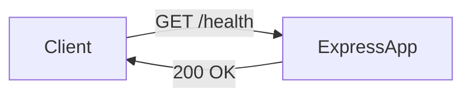

# Technical Specification (SPEC) - Health Check API

**Feature:** Health Check Endpoint
**Version:** 1.0
**Status:** Draft
**Author:** [ARCHITECT] Persona
**Reference:** `docs/planning/PRD-health-check.md`

## 1. Architecture Design

The Health Check endpoint will be implemented as a lightweight route in the existing Express.js application. It will not require database connectivity for the basic check, ensuring it reflects the application server's status.

### 1.1 Component Diagram



## 2. API Specification

### 2.1 Endpoint: `GET /health`

- **Description:** Returns the operational status of the API.
- **Auth:** None (Public).
- **Response Body:**

```json
{
  "status": "ok",
  "uptime": 123.45,
  "timestamp": "2025-11-21T10:00:00Z"
}
```

## 3. Implementation Details

### 3.1 File Structure

- **Modify:** `src/app.js` (or `src/routes/index.js` if applicable) to add the route.
- **New:** `src/controllers/health.controller.js` (Optional, but good practice for separation of concerns).
- **New:** `tests/health.test.js` (Integration test).

### 3.2 Logic

1. Calculate `uptime` using `process.uptime()`.
2. Return JSON object with static status "ok".

## 4. Testing Strategy

- **Unit Tests:** Verify controller logic.
- **Integration Tests:** Verify endpoint returns 200 via Supertest.
- **Local CI:** Run `act` to ensure tests pass in the pipeline.
