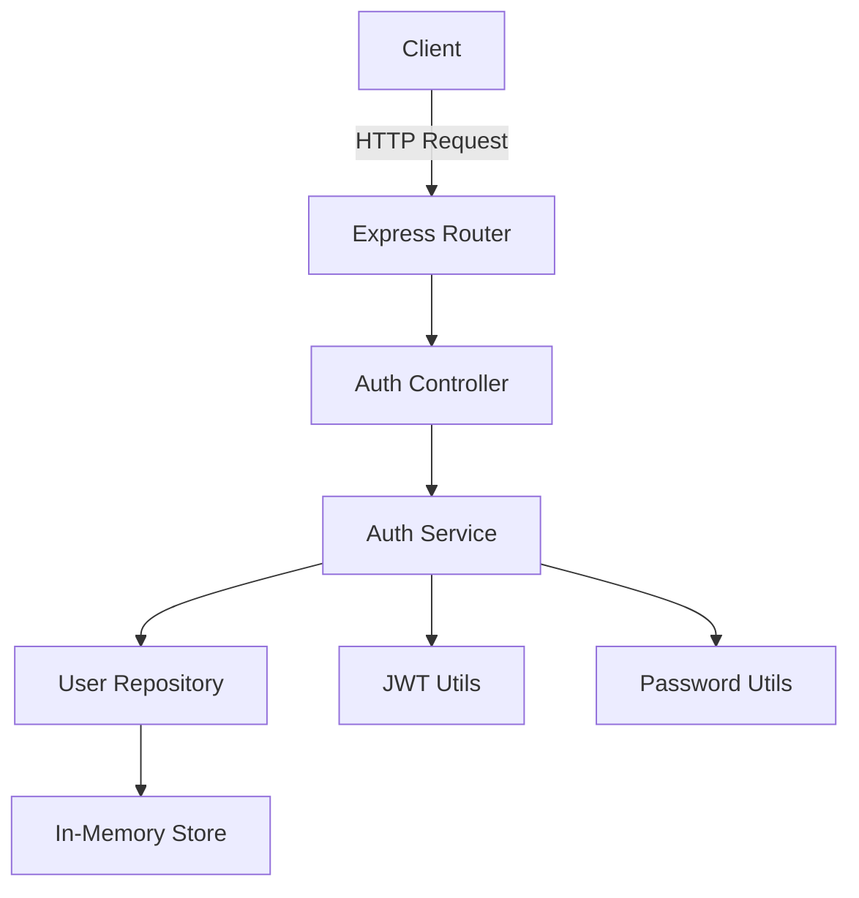

# Technical Specification

## User Authentication System

**Version:** 1.0  
**Date:** 2025-11-21  
**Author:** [ARCHITECT] Architect Persona  
**Related PRD:** [PRD-user-authentication.md](../planning/PRD-user-authentication.md)  
**Status:** Draft

---

## 1. Architecture Overview

### System Design

This is a minimal REST API implementing user authentication using JWT tokens. The system follows a layered architecture pattern.



### Components

1. **API Layer** (`src/routes/`) - Express routes
2. **Controller Layer** (`src/controllers/`) - Request/response handling
3. **Service Layer** (`src/services/`) - Business logic
4. **Repository Layer** (`src/repositories/`) - Data access
5. **Utilities** (`src/utils/`) - JWT, password hashing, validation

---

## 2. Technology Stack

### Core Dependencies

```json
{
  "express": "^4.18.2",
  "bcrypt": "^5.1.1",
  "jsonwebtoken": "^9.0.2",
  "dotenv": "^16.3.1"
}
```

### Development Dependencies

```json
{
  "jest": "^29.7.0",
  "supertest": "^6.3.3",
  "eslint": "^8.55.0",
  "prettier": "^3.1.1",
  "nodemon": "^3.0.2"
}
```

---

## 3. Project Structure

```
bmad-github-native-full-cycle/
├── src/
│   ├── index.js                 # Entry point
│   ├── app.js                   # Express app configuration
│   ├── config/
│   │   └── env.js              # Environment configuration
│   ├── routes/
│   │   └── auth.routes.js      # Authentication routes
│   ├── controllers/
│   │   └── auth.controller.js  # Auth request handlers
│   ├── services/
│   │   └── auth.service.js     # Auth business logic
│   ├── repositories/
│   │   └── user.repository.js  # User data access
│   ├── middleware/
│   │   └── auth.middleware.js  # JWT validation middleware
│   └── utils/
│       ├── jwt.util.js         # JWT generation/validation
│       ├── password.util.js    # Password hashing
│       └── validator.util.js   # Input validation
├── tests/
│   ├── unit/
│   │   ├── services/
│   │   └── utils/
│   └── integration/
│       └── auth.test.js
├── .env.example
├── package.json
└── jest.config.js
```

---

## 4. API Specification

### Base URL

```
http://localhost:3000/api/v1
```

### Endpoints

#### POST /auth/register

**Description:** Register a new user

**Request Body:**

```json
{
  "username": "string (3-20 chars, alphanumeric)",
  "email": "string (valid email format)",
  "password": "string (min 8 chars, 1 uppercase, 1 number)"
}
```

**Response (201 Created):**

```json
{
  "success": true,
  "message": "User registered successfully",
  "data": {
    "id": "uuid",
    "username": "string",
    "email": "string",
    "createdAt": "ISO 8601 timestamp"
  }
}
```

**Response (400 Bad Request):**

```json
{
  "success": false,
  "error": "Validation error message"
}
```

#### POST /auth/login

**Description:** Authenticate user and receive JWT token

**Request Body:**

```json
{
  "email": "string",
  "password": "string"
}
```

**Response (200 OK):**

```json
{
  "success": true,
  "message": "Login successful",
  "data": {
    "token": "JWT token string",
    "expiresIn": "24h",
    "user": {
      "id": "uuid",
      "username": "string",
      "email": "string"
    }
  }
}
```

**Response (401 Unauthorized):**

```json
{
  "success": false,
  "error": "Invalid credentials"
}
```

#### GET /auth/me

**Description:** Get current user information (protected route)

**Headers:**

```
Authorization: Bearer <JWT_TOKEN>
```

**Response (200 OK):**

```json
{
  "success": true,
  "data": {
    "id": "uuid",
    "username": "string",
    "email": "string",
    "createdAt": "ISO 8601 timestamp"
  }
}
```

**Response (401 Unauthorized):**

```json
{
  "success": false,
  "error": "Invalid or expired token"
}
```

---

## 5. Data Models

### User Model

```javascript
{
  id: String (UUID v4),
  username: String (unique, 3-20 chars),
  email: String (unique, valid format),
  passwordHash: String (bcrypt hash),
  createdAt: Date (ISO 8601),
  updatedAt: Date (ISO 8601)
}
```

### In-Memory Storage

```javascript
// Simple Map structure
const users = new Map();
// Key: user.id (UUID)
// Value: User object
```

---

## 6. Security Specifications

### Password Hashing

- **Algorithm:** bcrypt
- **Salt Rounds:** 10
- **Never store plain text passwords**

### JWT Configuration

- **Algorithm:** HS256

- **Secret:** Environment variable `JWT_SECRET`

- **Expiration:** 24 hours

- **Payload:**
  
  ```json
  {
    "userId": "uuid",
    "username": "string",
    "iat": timestamp,
    "exp": timestamp
  }
  ```

### Input Validation

- **Username:** 3-20 characters, alphanumeric + underscore
- **Email:** RFC 5322 compliant
- **Password:** Min 8 chars, at least 1 uppercase, 1 lowercase, 1 number

---

## 7. Error Handling

### Standard Error Response

```json
{
  "success": false,
  "error": "Error message",
  "code": "ERROR_CODE",
  "timestamp": "ISO 8601 timestamp"
}
```

### Error Codes

- `VALIDATION_ERROR` - Invalid input
- `USER_EXISTS` - Username/email already registered
- `INVALID_CREDENTIALS` - Wrong email/password
- `TOKEN_INVALID` - JWT validation failed
- `TOKEN_EXPIRED` - JWT expired
- `INTERNAL_ERROR` - Server error

---

## 8. Testing Strategy

### Unit Tests (Jest)

- `password.util.test.js` - Password hashing/verification
- `jwt.util.test.js` - Token generation/validation
- `validator.util.test.js` - Input validation
- `auth.service.test.js` - Business logic

### Integration Tests (Supertest)

- `auth.test.js` - Full API flow
  - Register user
  - Login with credentials
  - Access protected route
  - Error scenarios

### Coverage Target

- **Minimum:** 80%
- **Goal:** 90%+

---

## 9. Environment Configuration

### .env.example

```env
# Server
PORT=3000
NODE_ENV=development

# JWT
JWT_SECRET=your-super-secret-jwt-key-change-in-production
JWT_EXPIRES_IN=24h

# Bcrypt
BCRYPT_ROUNDS=10
```

---

## 10. Code Standards

### ESLint Configuration

```json
{
  "extends": ["eslint:recommended"],
  "env": {
    "node": true,
    "es2021": true,
    "jest": true
  },
  "rules": {
    "no-console": "warn",
    "no-unused-vars": "error",
    "semi": ["error", "always"],
    "quotes": ["error", "single"]
  }
}
```

### Prettier Configuration

```json
{
  "semi": true,
  "singleQuote": true,
  "tabWidth": 2,
  "trailingComma": "es5"
}
```

---

## 11. Performance Considerations

### Response Time Targets

- Registration: < 500ms (bcrypt hashing is expensive)
- Login: < 300ms
- Token validation: < 100ms

### Optimization Strategies

- Use async/await for all I/O operations
- Bcrypt rounds set to 10 (balance security/performance)
- In-memory storage for instant access

---

## 12. Deployment Notes

### Development

```bash
npm install
npm run dev  # Uses nodemon for hot reload
```

### Testing

```bash
npm test              # Run all tests
npm run test:watch    # Watch mode
npm run test:coverage # Coverage report
```

### Production (Future)

```bash
npm start  # Uses node directly
```

---

## 13. Future Enhancements (Out of Scope)

- Database persistence (PostgreSQL/MongoDB)
- Password reset flow
- Email verification
- Refresh tokens
- Rate limiting
- OAuth integration

---

## 14. Approval

**Status:** ✅ Approved for implementation  
**Next Step:** Hand over to [SCRUM] for task breakdown into GitHub Issues

---

**End of Technical Specification**
