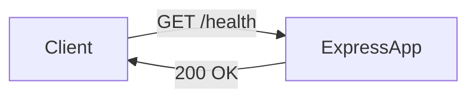

# Especificação Técnica (SPEC) - API de Health Check

**Funcionalidade:** Endpoint de Health Check
**Versão:** 1.0
**Status:** Rascunho
**Autor:** [ARCHITECT] Persona
**Referência:** `docs/planning/PRD-health-check.md`

## 1. Design de Arquitetura

O endpoint de Health Check será implementado como uma rota leve na aplicação Express.js existente. Não exigirá conectividade com banco de dados para a verificação básica, garantindo que reflita o status do servidor da aplicação.

### 1.1 Diagrama de Componentes



## 2. Especificação da API

### 2.1 Endpoint: `GET /health`

- **Descrição:** Retorna o status operacional da API.
- **Auth:** Nenhuma (Público).
- **Corpo da Resposta:**

```json
{
  "status": "ok",
  "uptime": 123.45,
  "timestamp": "2025-11-21T10:00:00Z"
}
```

## 3. Detalhes de Implementação

### 3.1 Estrutura de Arquivos

- **Modificar:** `src/app.js` (ou `src/routes/index.js` se aplicável) para adicionar a rota.
- **Novo:** `src/controllers/health.controller.js` (Opcional, mas boa prática para separação de responsabilidades).
- **Novo:** `tests/health.test.js` (Teste de integração).

### 3.2 Lógica

1. Calcular `uptime` usando `process.uptime()`.
2. Retornar objeto JSON com status estático "ok".

## 4. Estratégia de Testes

- **Testes Unitários:** Verificar lógica do controller.
- **Testes de Integração:** Verificar se o endpoint retorna 200 via Supertest.
- **CI Local:** Executar `act` para garantir que os testes passem no pipeline.
