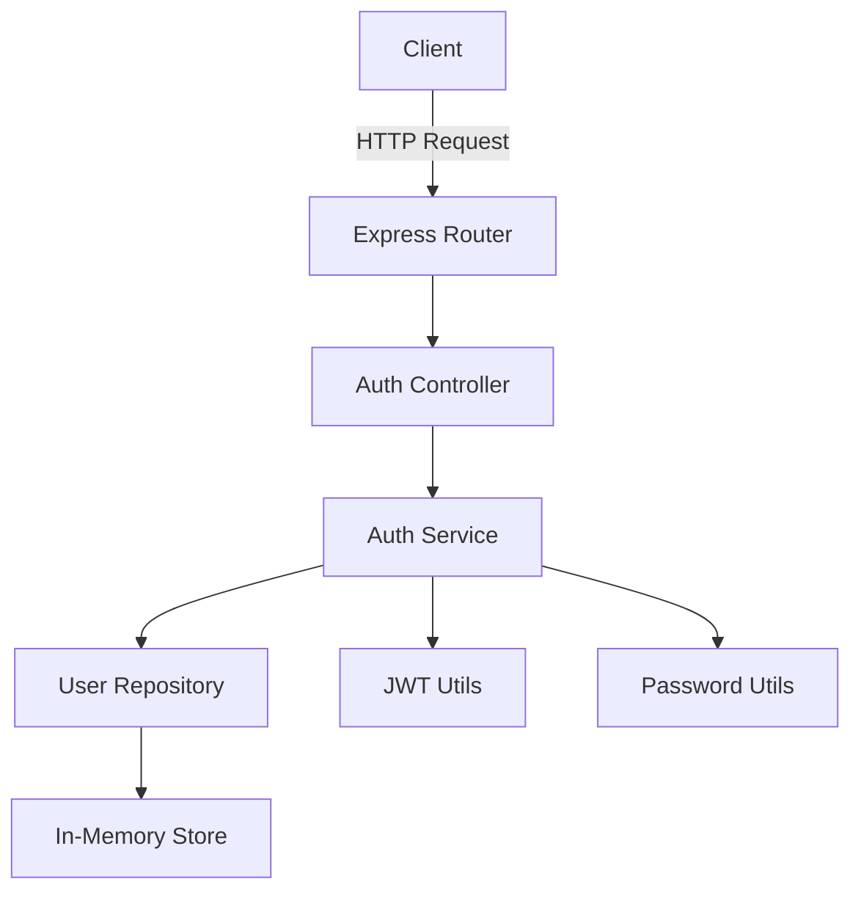

# Especificação Técnica

## Sistema de Autenticação de Usuário

**Versão:** 1.0
**Data:** 21/11/2025
**Autor:** [ARCHITECT] Persona Arquiteto
**PRD Relacionado:** [PRD-user-authentication.md](../planning/PRD-user-authentication.md)
**Status:** Rascunho

---

## 1. Visão Geral da Arquitetura

### Design do Sistema

Esta é uma API REST mínima implementando autenticação de usuário usando tokens JWT. O sistema segue um padrão de arquitetura em camadas.



### Componentes

1. **Camada de API** (`src/routes/`) - Rotas Express
2. **Camada de Controller** (`src/controllers/`) - Manipulação de requisição/resposta
3. **Camada de Serviço** (`src/services/`) - Lógica de negócios
4. **Camada de Repositório** (`src/repositories/`) - Acesso a dados
5. **Utilitários** (`src/utils/`) - JWT, hash de senha, validação

---

## 2. Stack Tecnológico

### Dependências Principais

```json
{
  "express": "^4.18.2",
  "bcrypt": "^5.1.1",
  "jsonwebtoken": "^9.0.2",
  "dotenv": "^16.3.1"
}
```

### Dependências de Desenvolvimento

```json
{
  "jest": "^29.7.0",
  "supertest": "^6.3.3",
  "eslint": "^8.55.0",
  "prettier": "^3.1.1",
  "nodemon": "^3.0.2"
}
```

---

## 3. Estrutura do Projeto

```
bmad-github-native-full-cycle/
├── src/
│   ├── index.js                 # Ponto de entrada
│   ├── app.js                   # Configuração do app Express
│   ├── config/
│   │   └── env.js              # Configuração de ambiente
│   ├── routes/
│   │   └── auth.routes.js      # Rotas de autenticação
│   ├── controllers/
│   │   └── auth.controller.js  # Handlers de requisição de Auth
│   ├── services/
│   │   └── auth.service.js     # Lógica de negócios de Auth
│   ├── repositories/
│   │   └── user.repository.js  # Acesso a dados de usuário
│   ├── middleware/
│   │   └── auth.middleware.js  # Middleware de validação JWT
│   └── utils/
│       ├── jwt.util.js         # Geração/validação de JWT
│       ├── password.util.js    # Hash de senha
│       └── validator.util.js   # Validação de entrada
├── tests/
│   ├── unit/
│   │   ├── services/
│   │   └── utils/
│   └── integration/
│       └── auth.test.js
├── .env.example
├── package.json
└── jest.config.js
```

---

## 4. Especificação da API

### URL Base

```
http://localhost:3000/api/v1
```

### Endpoints

#### POST /auth/register

**Descrição:** Registrar um novo usuário

**Corpo da Requisição:**

```json
{
  "username": "string (3-20 chars, alfanumérico)",
  "email": "string (formato de e-mail válido)",
  "password": "string (min 8 chars, 1 maiúscula, 1 número)"
}
```

**Resposta (201 Created):**

```json
{
  "success": true,
  "message": "User registered successfully",
  "data": {
    "id": "uuid",
    "username": "string",
    "email": "string",
    "createdAt": "ISO 8601 timestamp"
  }
}
```

**Resposta (400 Bad Request):**

```json
{
  "success": false,
  "error": "Mensagem de erro de validação"
}
```

#### POST /auth/login

**Descrição:** Autenticar usuário e receber token JWT

**Corpo da Requisição:**

```json
{
  "email": "string",
  "password": "string"
}
```

**Resposta (200 OK):**

```json
{
  "success": true,
  "message": "Login successful",
  "data": {
    "token": "JWT token string",
    "expiresIn": "24h",
    "user": {
      "id": "uuid",
      "username": "string",
      "email": "string"
    }
  }
}
```

**Resposta (401 Unauthorized):**

```json
{
  "success": false,
  "error": "Credenciais inválidas"
}
```

#### GET /auth/me

**Descrição:** Obter informações do usuário atual (rota protegida)

**Cabeçalhos:**

```
Authorization: Bearer <JWT_TOKEN>
```

**Resposta (200 OK):**

```json
{
  "success": true,
  "data": {
    "id": "uuid",
    "username": "string",
    "email": "string",
    "createdAt": "ISO 8601 timestamp"
  }
}
```

**Resposta (401 Unauthorized):**

```json
{
  "success": false,
  "error": "Token inválido ou expirado"
}
```

---

## 5. Modelos de Dados

### Modelo de Usuário

```javascript
{
  id: String (UUID v4),
  username: String (único, 3-20 chars),
  email: String (único, formato válido),
  passwordHash: String (hash bcrypt),
  createdAt: Date (ISO 8601),
  updatedAt: Date (ISO 8601)
}
```

### Armazenamento em Memória

```javascript
// Estrutura Map simples
const users = new Map();
// Chave: user.id (UUID)
// Valor: Objeto User
```

---

## 6. Especificações de Segurança

### Hash de Senha

- **Algoritmo:** bcrypt
- **Salt Rounds:** 10
- **Nunca armazenar senhas em texto plano**

### Configuração JWT

- **Algoritmo:** HS256
- **Segredo:** Variável de ambiente `JWT_SECRET`
- **Expiração:** 24 horas
- **Payload:**

  ```json
  {
    "userId": "uuid",
    "username": "string",
    "iat": timestamp,
    "exp": timestamp
  }
  ```

### Validação de Entrada

- **Username:** 3-20 caracteres, alfanumérico + underscore
- **Email:** Compatível com RFC 5322
- **Password:** Min 8 chars, pelo menos 1 maiúscula, 1 minúscula, 1 número

---

## 7. Tratamento de Erros

### Resposta de Erro Padrão

```json
{
  "success": false,
  "error": "Mensagem de erro",
  "code": "CODIGO_ERRO",
  "timestamp": "ISO 8601 timestamp"
}
```

### Códigos de Erro

- `VALIDATION_ERROR` - Entrada inválida
- `USER_EXISTS` - Nome de usuário/e-mail já registrado
- `INVALID_CREDENTIALS` - E-mail/senha incorretos
- `TOKEN_INVALID` - Falha na validação do JWT
- `TOKEN_EXPIRED` - JWT expirado
- `INTERNAL_ERROR` - Erro do servidor

---

## 8. Estratégia de Testes

### Testes Unitários (Jest)

- `password.util.test.js` - Hash/verificação de senha
- `jwt.util.test.js` - Geração/validação de token
- `validator.util.test.js` - Validação de entrada
- `auth.service.test.js` - Lógica de negócios

### Testes de Integração (Supertest)

- `auth.test.js` - Fluxo completo da API
  - Registrar usuário
  - Login com credenciais
  - Acessar rota protegida
  - Cenários de erro

### Meta de Cobertura

- **Mínimo:** 80%
- **Meta:** 90%+

---

## 9. Configuração de Ambiente

### .env.example

```env
# Server
PORT=3000
NODE_ENV=development

# JWT
JWT_SECRET=sua-chave-jwt-super-secreta-mude-em-producao
JWT_EXPIRES_IN=24h

# Bcrypt
BCRYPT_ROUNDS=10
```

---

## 10. Padrões de Código

### Configuração ESLint

```json
{
  "extends": ["eslint:recommended"],
  "env": {
    "node": true,
    "es2021": true,
    "jest": true
  },
  "rules": {
    "no-console": "warn",
    "no-unused-vars": "error",
    "semi": ["error", "always"],
    "quotes": ["error", "single"]
  }
}
```

### Configuração Prettier

```json
{
  "semi": true,
  "singleQuote": true,
  "tabWidth": 2,
  "trailingComma": "es5"
}
```

---

## 11. Considerações de Desempenho

### Metas de Tempo de Resposta

- Registro: < 500ms (hash bcrypt é custoso)
- Login: < 300ms
- Validação de token: < 100ms

### Estratégias de Otimização

- Usar async/await para todas as operações de I/O
- Bcrypt rounds definido como 10 (equilíbrio segurança/desempenho)
- Armazenamento em memória para acesso instantâneo

---

## 12. Notas de Deploy

### Desenvolvimento

```bash
npm install
npm run dev  # Usa nodemon para hot reload
```

### Testes

```bash
npm test              # Executa todos os testes
npm run test:watch    # Modo watch
npm run test:coverage # Relatório de cobertura
```

### Produção (Futuro)

```bash
npm start  # Usa node diretamente
```

---

## 13. Melhorias Futuras (Fora do Escopo)

- Persistência em banco de dados (PostgreSQL/MongoDB)
- Fluxo de redefinição de senha
- Verificação de e-mail
- Refresh tokens
- Rate limiting
- Integração OAuth

---

## 14. Aprovação

**Status:** ✅ Aprovado para implementação
**Próximo Passo:** Handover para [SCRUM] para quebra de tarefas em GitHub Issues

---

**Fim da Especificação Técnica**
