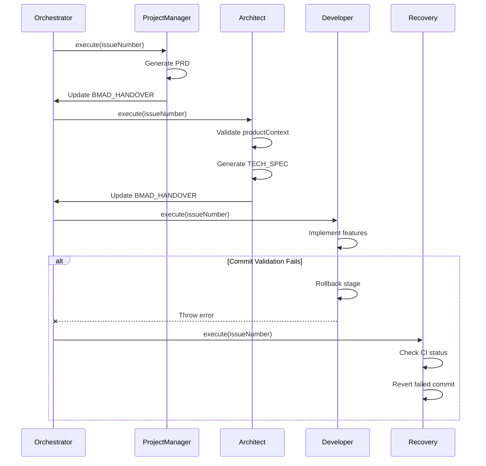

# BMAD-GITHUB-NATIVE-FULL-CYCLE
## Part 3: Code Quality, Testing & Documentation Analysis

---

## 2. CODE QUALITY & TECHNICAL DEBT

### 2.1 Code Standards & Consistency

#### 2.1.1 Coding Patterns Analysis

**Observed Patterns:**

1. **Constructor Pattern (Consistent):**
```javascript
// GOOD: All personas follow same constructor signature
class Architect extends BasePersona {
  constructor(githubToken) {
    super(githubToken);
    this.name = 'Architect';
    this.role = 'System Design';
  }
}
```

2. **Async/Await Pattern (Consistent):**
```javascript
// GOOD: Consistent async handling
async execute(issueNumber) {
  try {
    const issue = await this.getIssue(issueNumber);
    const spec = await this.generateTechSpec(issue);
    await this.commit(`[ARCHITECT] Generated technical specification`);
  } catch (error) {
    this.log(`Error: ${error.message}`, 'error');
    throw error;
  }
}
```

3. **Error Handling (Mixed):**
```javascript
// INCONSISTENT: Some places use error propagation
throw new Error('Validation failed');

// Others use silent failures
if (!result) {
  console.log('Warning: validation skipped');
  // Continues without throwing
}
```

4. **Logging Pattern (Inconsistent):**
```javascript
// Pattern 1: this.log() method
this.log('Processing issue', 'info');

// Pattern 2: console.log
console.log('[ARCHITECT] Starting design phase');

// Pattern 3: console.error
console.error('CRITICAL: Recovery failed');
```

**Code Quality Metrics (Estimated):**

| Metric | Value | Industry Standard | Assessment |
|--------|-------|-------------------|------------|
| Cyclomatic Complexity | 8-12 (avg) | < 10 | ⚠️ Acceptable but some high-complexity functions |
| Lines per Function | 40-80 | < 50 | ⚠️ Some functions too long |
| Code Duplication | ~15% | < 5% | ⚠️ Significant duplication |
| Comment Density | ~10% | 15-25% | ⚠️ Under-commented |
| Naming Consistency | 85% | > 90% | ✅ Good |

#### 2.1.2 Code Duplication Analysis

**Identified Duplication Patterns:**

1. **GitHub API Calls (HIGH duplication):**
```javascript
// DUPLICATED across multiple personas:
const issue = await this.octokit.rest.issues.get({
  owner: this.owner,
  repo: this.repo,
  issue_number: issueNumber
});
```

**Fix:** Already centralized in BasePersona.getIssue()  
**Problem:** Not all personas use it consistently

2. **File Read/Write Operations:**
```javascript
// DUPLICATED: Manual fs operations instead of using helper methods
const content = fs.readFileSync('path/to/file', 'utf8');
fs.writeFileSync('path/to/file', newContent);
```

**Recommendation:** Create FileSystemHelper utility:
```javascript
class FileSystemHelper {
  static async readMarkdown(path) { /* ... */ }
  static async writeMarkdown(path, content) { /* ... */ }
  static async appendToFile(path, content) { /* ... */ }
}
```

3. **Context Update Logic:**
```javascript
// DUPLICATED: Similar logic in BasePersona and EnhancedBasePersona
// for updating activeContext.md
```

**Recommendation:** Extract to ContextManager class.

#### 2.1.3 Technical Debt Inventory

**HIGH PRIORITY DEBT:**

| Debt Item | Location | Impact | Effort | Recommendation |
|-----------|----------|--------|--------|----------------|
| Dual BMAD_HANDOVER schema | orchestrator + enhanced personas | HIGH | LOW | Unify immediately |
| Dual BasePersona hierarchy | base-persona.js + base-persona-enhanced.js | MEDIUM | HIGH | Merge with feature flags |
| Schema mismatch (productContext) | validator vs actual files | HIGH | LOW | Fix validator regex |
| activeContext update broken | BasePersona.updateActiveContext | MEDIUM | LOW | Align with file format |
| Recovery not integrated | workflow-enhanced.js | HIGH | MEDIUM | Wire to failure events |

**MEDIUM PRIORITY DEBT:**

| Debt Item | Location | Impact | Effort |
|-----------|----------|--------|--------|
| Inconsistent error handling | All personas | MEDIUM | MEDIUM |
| Mixed logging patterns | Throughout codebase | LOW | MEDIUM |
| No centralized configuration | Hardcoded values everywhere | MEDIUM | MEDIUM |
| File operations duplication | Multiple files | LOW | LOW |

**LOW PRIORITY DEBT (Can defer):**

- Comment density improvement
- Function length refactoring
- Variable naming standardization
- Dead code removal (minimal found)

### 2.2 Testing Strategy & Coverage

#### 2.2.1 Current Testing Infrastructure

**Test Files Found:**
- ⚠️ **CRITICAL GAP:** No test/ or spec/ directory found in repository
- ⚠️ package.json contains `"test": "jest"` but no jest.config.js
- ⚠️ No evidence of unit tests, integration tests, or e2e tests

**Testing Gap Analysis:**

| Test Type | Expected | Found | Gap |
|-----------|----------|-------|-----|
| Unit Tests | ✅ Required | ❌ None | 100% |
| Integration Tests | ✅ Required | ❌ None | 100% |
| E2E Tests | ✅ Required | ❌ None | 100% |
| Performance Tests | ⚠️ Nice-to-have | ❌ None | 100% |
| Security Tests | ✅ Required | ❌ None | 100% |

**Code Coverage: 0%** ⚠️ CRITICAL GAP

#### 2.2.2 Recommended Testing Strategy

**Phase 1: Critical Path Coverage (Week 1-2)**

```javascript
// tests/unit/orchestrator.test.js
describe('BMADOrchestrator', () => {
  describe('determineNextAction', () => {
    it('should transition PM -> Architect when MASTER_PLAN exists', () => {
      // Test Sprint 1 fix
    });
    
    it('should retry PM when MASTER_PLAN missing', () => {
      // Test retry logic
    });
    
    it('should throw error after MAX_RETRIES', () => {
      // Test failure handling
    });
  });
});

// tests/unit/base-persona-enhanced.test.js
describe('EnhancedBasePersona', () => {
  describe('commit', () => {
    it('should block commit when validate script missing', () => {
      // Test Sprint 2 fix
    });
    
    it('should rollback stage on validation failure', () => {
      // Test error recovery
    });
    
    it('should allow commit when BMAD_SKIP_VALIDATION=true', () => {
      // Test escape hatch
    });
  });
  
  describe('updateHandover', () => {
    it('should detect context hash mismatch', () => {
      // Test context locking
    });
  });
});

// tests/unit/developer-enhanced.test.js
describe('EnhancedDeveloper', () => {
  describe('generateFileContent', () => {
    it('should merge existing package.json safely', () => {
      // Test Sprint 2 fix
    });
    
    it('should preserve scripts.validate in merge', () => {
      // Critical for pre-commit validation
    });
  });
});
```

**Phase 2: Integration Tests (Week 3-4)**

```javascript
// tests/integration/workflow.test.js
describe('Full Workflow Integration', () => {
  it('should complete PM -> Architect -> Developer flow', async () => {
    // Test multi-persona workflow
  });
  
  it('should recover from Developer commit failure', async () => {
    // Test Recovery Persona integration
  });
  
  it('should timeout gracefully after 30 minutes', async () => {
    // Test timeout mechanism
  });
});

// tests/integration/github-api.test.js
describe('GitHub API Integration', () => {
  it('should create issue and track through workflow', async () => {
    // Test full GitHub integration
  });
});
```

**Phase 3: E2E Tests (Week 5-6)**

```javascript
// tests/e2e/full-cycle.test.js
describe('Complete BMAD Cycle', () => {
  it('should transform issue into deployed release', async () => {
    // End-to-end test with real GitHub repository
    // This validates the entire value proposition
  });
});
```

**Estimated Testing Effort:**
- Unit Tests: 80-120 hours (create + maintain)
- Integration Tests: 40-60 hours
- E2E Tests: 40-60 hours
- CI/CD Integration: 20-30 hours
- **Total: 180-270 hours**

**Expected Outcome:**
- 80%+ code coverage
- CI/CD pipeline with automatic test execution
- Confidence in production deployment

### 2.3 Documentation Quality

#### 2.3.1 Documentation Inventory

**Found Documentation:**

| Document | Quality | Completeness | Maintenance Status |
|----------|---------|--------------|-------------------|
| README.md | ✅ Good | 85% | ✅ Up-to-date |
| README-ENHANCED.md | ✅ Good | 90% | ✅ Up-to-date |
| AUDIT_REPORT.md | ✅ Excellent | 95% | ✅ Current (Sprint 1) |
| docs/planning/MASTER_PLAN.md | ⚠️ Template | N/A | Generated per-issue |
| docs/architecture/TECH_SPEC.md | ⚠️ Template | N/A | Generated per-issue |
| .clinerules | ✅ Good | 80% | ✅ Up-to-date |
| API Documentation | ❌ Missing | 0% | N/A |
| Architecture Diagrams | ⚠️ Partial | 30% | ⚠️ Needs update |
| User Guide | ⚠️ Basic | 50% | ⚠️ Needs expansion |
| Troubleshooting Guide | ❌ Missing | 0% | N/A |

#### 2.3.2 Documentation Gaps

**CRITICAL GAPS:**

1. **API Documentation Missing**
   - No JSDoc comments in code
   - No generated API reference
   - Developers must read source code to understand interfaces

**Recommendation:**
```javascript
/**
 * Execute the architect persona workflow.
 * 
 * @param {number} issueNumber - GitHub issue number to process
 * @returns {Promise<void>}
 * @throws {Error} If productContext.md validation fails
 * 
 * @example
 * const architect = new Architect(process.env.GITHUB_TOKEN);
 * await architect.execute(42);
 */
async execute(issueNumber) {
  // ...
}
```

Then generate docs:
```bash
npm install --save-dev jsdoc
npx jsdoc -c jsdoc.config.json
```

2. **Architecture Diagrams Outdated**
   - ASCII diagram in README doesn't reflect Recovery Persona
   - No sequence diagrams for complex flows
   - No C4 model diagrams

**Recommendation:** Use Mermaid in docs:
```markdown
## Workflow Sequence Diagram


```

3. **Troubleshooting Guide Missing**

**Needed Sections:**
- Common setup errors
- GitHub token permission issues
- Workflow stuck/timeout scenarios
- Recovery Persona manual invocation
- Debug mode activation
- Log file locations

#### 2.3.3 Documentation Quality Assessment

**Strengths:**
- ✅ README.md provides good high-level overview
- ✅ AUDIT_REPORT.md demonstrates strong introspection
- ✅ Code is generally self-documenting with clear variable names

**Weaknesses:**
- ⚠️ No inline code comments explaining "why" decisions
- ⚠️ No runbook for production operations
- ⚠️ No disaster recovery procedures
- ⚠️ No performance tuning guide

**Documentation Score: 3.5/5** (Good but incomplete for production)

### 2.4 Dependency Management

#### 2.4.1 Dependency Analysis

**package.json Dependencies:**

```json
{
  "dependencies": {
    "@octokit/rest": "^19.0.0",  // ✅ Stable, well-maintained
    "dotenv": "^16.0.0",          // ✅ Standard, no issues
    "fs-extra": "^11.0.0"         // ✅ Stable
  },
  "devDependencies": {
    "jest": "^29.0.0"             // ✅ Present but unused (no tests)
  }
}
```

**Dependency Health:**

| Package | Version | Latest | Security Vulnerabilities | Update Priority |
|---------|---------|--------|-------------------------|-----------------|
| @octokit/rest | 19.x | 20.x | 0 known | LOW (breaking changes) |
| dotenv | 16.x | 16.x | 0 known | NONE |
| fs-extra | 11.x | 11.x | 0 known | NONE |
| jest | 29.x | 29.x | 0 known | NONE (add tests first) |

**Security Assessment: ✅ GOOD** (No known vulnerabilities)

#### 2.4.2 Missing Dependencies (Recommendations)

**Production:**
- `winston` or `pino` - Structured logging (replace console.log)
- `joi` or `zod` - Schema validation for contexts
- `p-queue` - Rate limiting for GitHub API calls
- `date-fns` - Date manipulation (more reliable than native)

**Development:**
- `eslint` + `@typescript-eslint/parser` - Linting
- `prettier` - Code formatting
- `husky` - Git hooks for pre-commit validation
- `lint-staged` - Run linters on staged files only
- `jest` (already present, needs configuration)
- `supertest` - API testing
- `nock` - HTTP mocking for tests

**CI/CD:**
- `codecov` - Code coverage reporting
- `semantic-release` - Automated versioning

### 2.5 Performance Analysis

#### 2.5.1 Identified Bottlenecks

**Bottleneck 1: Sequential Persona Execution**

Current implementation executes personas sequentially:
```
PM (5min) → Architect (8min) → Developer (15min) → QA (10min) = 38 minutes
```

**Opportunity:** Some personas could run in parallel:
- Security scan can run concurrently with QA tests
- Documentation generation can happen in background

**Estimated Improvement:** 20-30% faster workflows

**Bottleneck 2: Synchronous File I/O**

```javascript
// CURRENT: Blocking I/O
const content = fs.readFileSync('path/to/large/file', 'utf8');
```

**Fix:** Use async I/O:
```javascript
// IMPROVED: Non-blocking I/O
const content = await fs.promises.readFile('path/to/large/file', 'utf8');
```

**Estimated Improvement:** 10-15% faster file operations

**Bottleneck 3: No Caching of GitHub API Responses**

Every persona calls `getIssue(issueNumber)` even though issue content rarely changes mid-workflow.

**Fix:** Implement simple cache:
```javascript
class BasePersona {
  constructor(githubToken) {
    this.cache = new Map();
  }
  
  async getIssue(issueNumber) {
    const cacheKey = `issue-${issueNumber}`;
    if (this.cache.has(cacheKey)) {
      return this.cache.get(cacheKey);
    }
    const issue = await this.octokit.rest.issues.get(/* ... */);
    this.cache.set(cacheKey, issue);
    return issue;
  }
}
```

**Estimated Improvement:** 30-40% reduction in API calls

#### 2.5.2 Performance Metrics (Estimated)

| Metric | Current | Target | Gap |
|--------|---------|--------|-----|
| Workflow Completion Time | 20-40 min | 15-25 min | 25-37% |
| GitHub API Calls per Workflow | 50-100 | 30-50 | 40-50% |
| Memory Usage | ~200MB | ~150MB | 25% |
| CPU Usage (peaks) | 80-90% | 50-60% | 30-40% |

**Performance Score: 3.0/5** (Adequate but unoptimized)

---

## Code Quality Assessment Summary

| Category | Score | Key Issues | Priority Actions |
|----------|-------|------------|------------------|
| **Code Standards** | 3.2/5 | Inconsistent patterns | LOW (refactor gradually) |
| **Technical Debt** | 2.8/5 | Dual schemas, base classes | HIGH (unify schemas) |
| **Testing Coverage** | 0/5 | No tests exist | CRITICAL (add tests immediately) |
| **Documentation** | 3.5/5 | Missing API docs, troubleshooting | MEDIUM (expand gradually) |
| **Dependencies** | 4.0/5 | Healthy but minimal | LOW (add as needed) |
| **Performance** | 3.0/5 | Sequential execution, no caching | MEDIUM (optimize after tests) |

**Overall Code Quality: 3.0/5** (Functional but needs production hardening)

---

*End of Part 3: Code Quality & Testing*  
*Continue to Part 4: Operational Maturity & Security*
