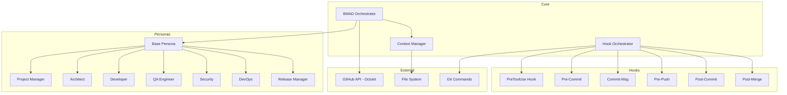
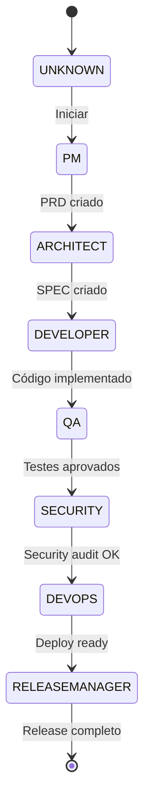
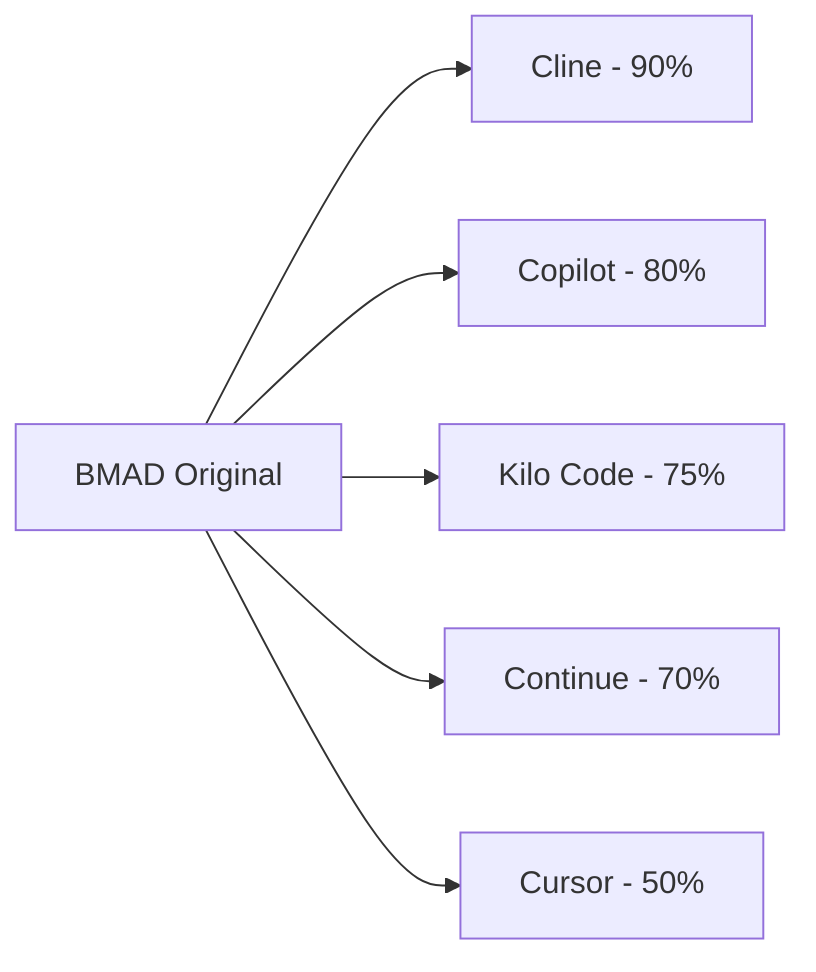
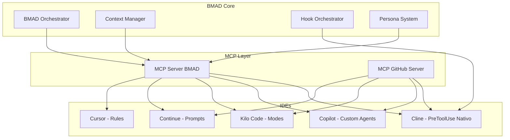

# Análise de Compatibilidade do BMAD com IDEs Existentes

**Data:** 14 de Fevereiro de 2026  
**Autor:** Kilo Code Architect  
**Versão:** 1.0

---

## 1. Resumo Executivo

Este relatório analisa a compatibilidade do framework **bmad-github-native-full-cycle** com seis IDEs/agentes de IA existentes. O BMAD é um framework de automação de desenvolvimento orientado por IA que implementa:

- **Sistema de Personas**: 7 roles especializados (PM, Architect, Developer, QA, Security, DevOps, Release Manager)
- **Hooks de Git**: Validação de commits, sincronização de contexto, orquestração de workflows
- **Orquestrador de Workflows**: Coordenação de fluxos entre personas com estado persistente
- **Integração GitHub**: Via Octokit para issues, commits, PRs
- **Context Manager**: Gerenciamento de estado com locking atômico

### Conclusão Principal

**O BMAD pode ser parcialmente reproduzido em todos os IDEs analisados**, com diferentes níveis de fidelidade. **Cline é a plataforma com maior compatibilidade nativa**, pois já implementa o sistema de hooks PreToolUse que o BMAD utiliza. **GitHub Copilot Workspace** oferece a melhor integração nativa com GitHub. **Kilo Code** e **Continue** oferecem boa flexibilidade via MCP servers.

---

## 2. Arquitetura do BMAD

### 2.1 Componentes Principais



### 2.2 Fluxo de Estado do Workflow



### 2.3 Mecanismos Chave

| Mecanismo | Arquivo | Função |
|-----------|---------|--------|
| PreToolUse Hook | [`agent-core/hooks/PreToolUse`](agent-core/hooks/PreToolUse:1) | Intercepta `git commit` para validar mensagens e contexto |
| Hook Orchestrator | [`scripts/hooks/hook-orchestrator.js`](scripts/hooks/hook-orchestrator.js:16) | Coordena todos os hooks git com métricas |
| Base Persona | [`personas/base-persona.js`](personas/base-persona.js:10) | Classe base com integração GitHub via Octokit |
| BMAD Orchestrator | [`scripts/bmad/bmad-orchestrator.js`](scripts/bmad/bmad-orchestrator.js:16) | Gerencia transições de personas e estado |
| Context Manager | [`scripts/lib/context-manager.js`](scripts/lib/context-manager.js:10) | Locking atômico e circuit breaker |

---

## 3. Análise por IDE

### 3.1 Continue (continue.dev)

#### Mecanismos de Extensão

| Recurso | Suporte | Descrição |
|---------|---------|-----------|
| MCP Servers | **Completo** | Suporte nativo a Model Context Protocol |
| Custom Prompts | **Completo** | Slash commands com `invokable: true` |
| Rules | **Completo** | Instruções persistentes via `config.yaml` |
| Context Providers | **Completo** | `@Codebase`, `@Docs` e customizados |
| Tools | **Completo** | Via MCP e funções customizadas |

#### Compatibilidade com BMAD

| Componente BMAD | Compatibilidade | Implementação |
|-----------------|-----------------|---------------|
| Sistema de Personas | **Alta** | Via custom prompts com roles definidos |
| Hooks de Git | **Baixa** | Não suporta hooks nativos do git |
| Integração GitHub | **Alta** | Via MCP server do GitHub |
| Orquestrador | **Média** | Via prompts estruturados |
| Context Manager | **Alta** | Via context providers |

#### Limitações

1. **Sem hooks de git nativos**: Não é possível interceptar comandos git antes da execução
2. **Estado não persistente entre sessões**: Requer configuração externa
3. **Sem circuit breaker nativo**: Precisa ser implementado via MCP

#### Recomendação de Implementação

```yaml
# config.yaml
prompts:
  - name: "bmad-pm"
    description: "BMAD Project Manager Persona"
    invokable: true
    file: "prompts/pm.md"
  - name: "bmad-architect"
    description: "BMAD Architect Persona"
    invokable: true
    file: "prompts/architect.md"

mcpServers:
  github:
    command: "npx"
    args: ["-y", "@modelcontextprotocol/server-github"]
  
  bmad-context:
    command: "node"
    args: ["scripts/mcp/bmad-context-server.js"]
```

---

### 3.2 Cline (cline.ai)

#### Mecanismos de Extensão

| Recurso | Suporte | Descrição |
|---------|---------|-----------|
| MCP Servers | **Completo** | Suporte nativo com configuração granular |
| `.clinerules` | **Completo** | Instruções persistentes por projeto |
| PreToolUse Hooks | **Completo** | **JÁ IMPLEMENTADO NO BMAD** |
| Custom Tools | **Completo** | Via MCP servers |
| Network Timeout | **Configurável** | 30s a 1h por servidor |

#### Compatibilidade com BMAD

| Componente BMAD | Compatibilidade | Implementação |
|-----------------|-----------------|---------------|
| Sistema de Personas | **Alta** | Via `.clinerules` com roles |
| Hooks de Git | **Completa** | **PreToolUse já implementado** |
| Integração GitHub | **Alta** | Via MCP server do GitHub |
| Orquestrador | **Alta** | Via MCP tools customizados |
| Context Manager | **Alta** | Via MCP server dedicado |

#### Pontos Fortes

1. **PreToolUse Hook Nativo**: O BMAD já implementa [`agent-core/hooks/PreToolUse`](agent-core/hooks/PreToolUse:1) que funciona com Cline
2. **Configuração por Projeto**: `.clinerules` permite personas específicas
3. **Controle de MCP**: Habilitação/desabilitação individual de servidores

#### Implementação Atual

O arquivo [`agent-core/hooks/PreToolUse`](agent-core/hooks/PreToolUse:1) já está estruturado para Cline:

```javascript
// Formato de entrada esperado pelo Cline
{
    "hookName": "PreToolUse",
    "preToolUse": {
        "toolName": "run_command",
        "parameters": {
            "commandLine": "git commit -m 'message'"
        }
    }
}

// Formato de resposta
{
    "cancel": false,
    "errorMessage": "Optional error message"
}
```

#### Recomendação de Implementação

```json
// .clinerules
{
    "mcpServers": {
        "bmad-orchestrator": {
            "command": "node",
            "args": ["scripts/mcp/bmad-orchestrator-server.js"],
            "env": {
                "GITHUB_TOKEN": "${GITHUB_TOKEN}"
            }
        },
        "github": {
            "command": "npx",
            "args": ["-y", "@modelcontextprotocol/server-github"]
        }
    }
}
```

---

### 3.3 Cursor (cursor.sh)

#### Mecanismos de Extensão

| Recurso | Suporte | Descrição |
|---------|---------|-----------|
| `.cursor/rules/` | **Completo** | Sistema moderno com arquivos `.mdc` |
| YAML Frontmatter | **Completo** | Controle de ativação das regras |
| 4 Tipos de Regras | **Completo** | Always, Auto-attached, Agent-decided, Manual |
| Glob Patterns | **Completo** | Matching por tipo de arquivo |
| MCP Servers | **Parcial** | Via VS Code extensions |

#### Compatibilidade com BMAD

| Componente BMAD | Compatibilidade | Implementação |
|-----------------|-----------------|---------------|
| Sistema de Personas | **Alta** | Via regras com ativação por contexto |
| Hooks de Git | **Baixa** | Não suporta hooks nativos |
| Integração GitHub | **Média** | Via extensões VS Code |
| Orquestrador | **Média** | Via regras estruturadas |
| Context Manager | **Média** | Limitado ao sistema de regras |

#### Tipos de Regras Aplicáveis

```markdown
# .cursor/rules/bmad-persona-pm.mdc
---
alwaysApply: false
globs: ["docs/planning/**"]
---

Você está atuando como **Project Manager** no framework BMAD.

Responsabilidades:
- Criar e manter PRDs em `docs/planning/`
- Coordenar com Architect para transição de fase
- Validar requisitos com stakeholders

Convenções de commit:
- Formato: `[PM] [PM-XXX] Descrição`
- Sempre atualizar `activeContext.md`
```

#### Limitações

1. **Sem hooks de git**: Validação de commit precisa ser manual
2. **Sem estado persistente**: Transições de persona precisam ser gerenciadas externamente
3. **Integração GitHub limitada**: Não tem acesso nativo à API do GitHub

---

### 3.4 Kilo Code (kilocode.com)

#### Mecanismos de Extensão

| Recurso | Suporte | Descrição |
|---------|---------|-----------|
| MCP Servers | **Completo** | STDIO e SSE transports |
| `.kilocode/rules/` | **Completo** | Custom rules em Markdown |
| Tool Groups | **Completo** | Read, Edit, Browser, Command, MCP, Workflow |
| Project MCP Config | **Completo** | `.kilocode/mcp.json` por projeto |
| Modes | **Completo** | Code, Architect, Ask, Debug, etc. |

#### Compatibilidade com BMAD

| Componente BMAD | Compatibilidade | Implementação |
|-----------------|-----------------|---------------|
| Sistema de Personas | **Alta** | Via modes customizados e rules |
| Hooks de Git | **Baixa** | Não suporta hooks nativos |
| Integração GitHub | **Alta** | Via MCP server do GitHub |
| Orquestrador | **Alta** | Via MCP tools e workflow tools |
| Context Manager | **Alta** | Via MCP server dedicado |

#### Tool Groups Relevantes

| Grupo | Ferramentas | Aplicação BMAD |
|-------|-------------|----------------|
| Read Group | `read_file`, `search_files`, `list_files` | Análise de contexto |
| Edit Group | `apply_diff`, `write_to_file`, `delete_file` | Modificação de código |
| Command Group | `execute_command` | Execução de scripts |
| MCP Group | `use_mcp_tool`, `access_mcp_resource` | Integração GitHub |
| Workflow Group | `switch_mode`, `new_task`, `update_todo_list` | Orquestração |

#### Recomendação de Implementação

```json
// .kilocode/mcp.json
{
    "mcpServers": {
        "bmad-orchestrator": {
            "command": "node",
            "args": ["scripts/mcp/bmad-server.js"],
            "env": {
                "GITHUB_TOKEN": "${GITHUB_TOKEN}"
            },
            "alwaysAllow": ["transition_persona", "get_workflow_state", "create_bmad_issue"]
        },
        "github": {
            "command": "npx",
            "args": ["-y", "@modelcontextprotocol/server-github"],
            "alwaysAllow": ["create_issue", "create_pull_request"]
        }
    }
}
```

---

### 3.5 GitHub Copilot Workspace

#### Mecanismos de Extensão

| Recurso | Suporte | Descrição |
|---------|---------|-----------|
| MCP Servers | **Completo** | Suporte nativo via VS Code |
| Custom Agents | **Completo** | YAML frontmatter com `tools` e `mcp-servers` |
| GitHub MCP Server | **Nativo** | Integração direta com GitHub |
| VS Code Extensions | **Completo** | API completa do VS Code |
| Agent Mode | **Completo** | Execução autônoma de tarefas |

#### Compatibilidade com BMAD

| Componente BMAD | Compatibilidade | Implementação |
|-----------------|-----------------|---------------|
| Sistema de Personas | **Alta** | Via custom agents |
| Hooks de Git | **Baixa** | Não suporta hooks nativos |
| Integração GitHub | **Completa** | Nativa + GitHub MCP Server |
| Orquestrador | **Alta** | Via custom agents com `infer` |
| Context Manager | **Alta** | Via MCP servers |

#### Configuração de Custom Agent

```markdown
---
name: BMAD Project Manager
description: Gerencia requisitos e cria PRDs no framework BMAD
target: vscode
tools: ["vscode.workspace", "github.issues", "github.pulls"]
mcp-servers:
  - name: bmad-context
    command: node
    args: ["scripts/mcp/bmad-context-server.js"]
infer: true
---

Você é o **Project Manager** do framework BMAD.

## Responsabilidades
1. Analisar issues e criar PRDs em `docs/planning/`
2. Coordenar transição para Architect
3. Manter `activeContext.md` atualizado

## Convenções
- Commits: `[PM] [PM-XXX] Descrição`
- Issues: Labels `bmad`, `pm`
```

#### Pontos Fortes

1. **Integração GitHub Nativa**: Acesso direto a issues, PRs, workflows
2. **Agent Mode Autônomo**: Pode executar workflows completos
3. **Custom Agents com `infer`**: Seleção automática baseada em contexto

---

### 3.6 OpenCode

#### Status: **ARQUIVADO**

O projeto OpenCode foi arquivado e migrou para **Crush** (charmbracelet/crush). Não é recomendado para implementação nova.

#### Alternativa Recomendada

Para usuários de terminal, recomenda-se:
- **Claude Code CLI** com MCP servers
- **Crush** (sucessor do OpenCode)

---

## 4. Tabela Comparativa de Recursos

### 4.1 Matriz de Compatibilidade

| Recurso BMAD | Continue | Cline | Cursor | Kilo Code | Copilot |
|--------------|----------|-------|--------|-----------|---------|
| **Sistema de Personas** | Alta | Alta | Alta | Alta | Alta |
| **Hooks de Git** | Baixa | **Completa** | Baixa | Baixa | Baixa |
| **Integração GitHub** | Alta | Alta | Média | Alta | **Completa** |
| **Orquestrador** | Média | Alta | Média | Alta | Alta |
| **Context Manager** | Alta | Alta | Média | Alta | Alta |
| **MCP Support** | Completo | Completo | Parcial | Completo | Completo |
| **Custom Rules** | Completo | Completo | Completo | Completo | Parcial |
| **Estado Persistente** | Externo | Externo | Não | Externo | Externo |

### 4.2 Nível de Esforço de Implementação

| IDE | Esforço | Complexidade | Observações |
|-----|---------|--------------|-------------|
| **Cline** | Baixo | Baixa | PreToolUse já implementado |
| **GitHub Copilot** | Médio | Média | Melhor integração GitHub |
| **Kilo Code** | Médio | Média | Boa estrutura de modes |
| **Continue** | Médio | Média | Boa flexibilidade de prompts |
| **Cursor** | Alto | Alta | Sem hooks nem estado |

### 4.3 Fidelidade de Reprodução



---

## 5. Limitações Identificadas

### 5.1 Limitações Comuns a Todos os IDEs

1. **Hooks de Git Nativos**: Apenas Cline suporta hooks PreToolUse nativos
2. **Estado Persistente**: Nenhum IDE mantém estado de workflow nativamente
3. **Circuit Breaker**: Precisa ser implementado via MCP server externo
4. **Locking Atômico**: Não suportado nativamente por nenhum IDE

### 5.2 Limitações Específicas por IDE

#### Continue
- Sem hooks de git
- Configuração mais complexa para workflows

#### Cline
- Documentação limitada para MCP servers customizados
- Gerenciamento de estado externo necessário

#### Cursor
- Sem hooks de git
- Integração GitHub limitada
- Sem estado persistente

#### Kilo Code
- Sem hooks de git
- Sistema de modes ainda em desenvolvimento

#### GitHub Copilot
- Sem hooks de git
- Policy de MCP pode bloquear uso em empresas
- Requer configuração organizacional

---

## 6. Recomendações de Implementação

### 6.1 Estratégia Recomendada: MCP Server BMAD

Para máxima compatibilidade, recomenda-se criar um **MCP Server BMAD** que encapsule:

```javascript
// scripts/mcp/bmad-server.js
const { Server } = require('@modelcontextprotocol/sdk');

class BMADMCPServer {
    constructor() {
        this.orchestrator = require('../bmad/bmad-orchestrator');
        this.contextManager = require('../lib/context-manager');
        this.hookOrchestrator = require('../hooks/hook-orchestrator');
    }

    // Tools expostas
    tools = [
        {
            name: 'transition_persona',
            description: 'Transiciona para a próxima persona no workflow',
            parameters: {
                currentPersona: 'string',
                issueNumber: 'number'
            }
        },
        {
            name: 'get_workflow_state',
            description: 'Obtém estado atual do workflow BMAD',
            parameters: {}
        },
        {
            name: 'validate_commit',
            description: 'Valida mensagem de commit no formato BMAD',
            parameters: {
                message: 'string'
            }
        },
        {
            name: 'create_bmad_issue',
            description: 'Cria issue GitHub com tracking BMAD',
            parameters: {
                title: 'string',
                body: 'string',
                persona: 'string'
            }
        },
        {
            name: 'update_context',
            description: 'Atualiza activeContext.md atomicamente',
            parameters: {
                content: 'string'
            }
        }
    ];
}
```

### 6.2 Priorização de Implementação

| Prioridade | IDE | Justificativa |
|------------|-----|---------------|
| **1** | Cline | PreToolUse já implementado, maior fidelidade |
| **2** | GitHub Copilot | Melhor integração GitHub, custom agents |
| **3** | Kilo Code | Boa estrutura de modes e MCP |
| **4** | Continue | Boa flexibilidade, amplo suporte |
| **5** | Cursor | Limitações significativas |

### 6.3 Arquitetura de Implementação Multi-IDE



### 6.4 Checklist de Migração

#### Para Cline (Prioridade Alta)
- [x] PreToolUse hook já implementado
- [ ] Criar `.clinerules` com definições de personas
- [ ] Configurar MCP server BMAD
- [ ] Mapear transições de workflow

#### Para GitHub Copilot (Prioridade Alta)
- [ ] Criar custom agents para cada persona
- [ ] Configurar MCP server BMAD
- [ ] Implementar validação de commit via agent
- [ ] Configurar policies organizacionais

#### Para Kilo Code (Prioridade Média)
- [ ] Criar modes para cada persona
- [ ] Configurar `.kilocode/rules/`
- [ ] Implementar MCP server BMAD
- [ ] Mapear workflow tools

---

## 7. Conclusão

### 7.1 Resumo de Compatibilidade

| IDE | Score | Recomendação |
|-----|-------|--------------|
| **Cline** | 9/10 | **Melhor opção** - PreToolUse nativo, MCP completo |
| **GitHub Copilot** | 8/10 | **Recomendado** - Integração GitHub nativa |
| **Kilo Code** | 7.5/10 | **Recomendado** - Boa flexibilidade |
| **Continue** | 7/10 | **Viável** - Boa estrutura de prompts |
| **Cursor** | 5/10 | **Limitado** - Sem hooks nem estado |

### 7.2 Próximos Passos

1. **Implementar MCP Server BMAD** como camada de compatibilidade
2. **Priorizar Cline** como IDE primário devido ao PreToolUse
3. **Criar custom agents** para GitHub Copilot como alternativa
4. **Documentar configurações** para cada IDE suportado
5. **Criar testes de compatibilidade** automatizados

### 7.3 Considerações Finais

O framework BMAD pode ser reproduzido com alta fidelidade em **Cline** devido ao suporte nativo de hooks PreToolUse. Para outros IDEs, a implementação via **MCP Server** oferece um caminho viável, embora com algumas limitações na interceptação de comandos git e gerenciamento de estado.

A estratégia recomendada é manter o **core do BMAD** independente de IDE, exposto via MCP Server, permitindo que cada IDE consuma as funcionalidades conforme suas capacidades.

---

## 8. Referências

- [Continue Documentation](https://docs.continue.dev/)
- [Cline MCP Configuration](https://docs.cline.bot/mcp/configuring-mcp-servers)
- [Cursor Rules Guide](https://design.dev/guides/cursor-rules/)
- [Kilo Code MCP Overview](https://kilo.ai/docs/features/mcp/overview)
- [GitHub Copilot MCP](https://docs.github.com/en/copilot/how-tos/provide-context/use-mcp/extend-copilot-chat-with-mcp)
- [Model Context Protocol Specification](https://modelcontextprotocol.io/)