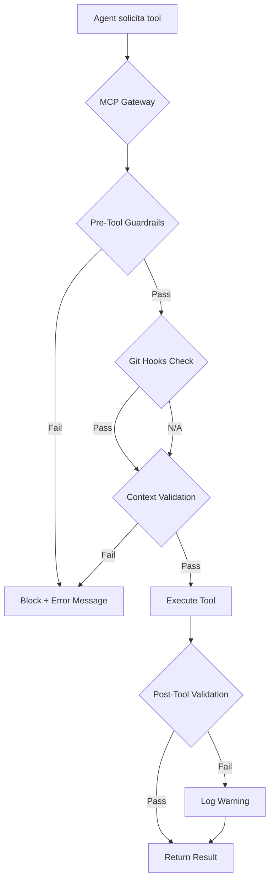

# Análise de Alternativas ao PreToolUse para IDEs

## 1. Análise do PreToolUse Atual

### 1.1 Visão Geral
O **PreToolUse** é um hook implementado no BMAD que intercepta ações antes da execução de ferramentas pelo agente de IA. A implementação atual está em [`agent-core/hooks/PreToolUse`](agent-core/hooks/PreToolUse:1).

### 1.2 Funcionalidades Principais
| Funcionalidade | Descrição |
|----------------|-----------|
| **Validação de Commit** | Intercepta `git commit` para validar formato |
| **Conventional Commits** | Verifica padrão `type(scope): description` |
| **Context Update** | Exige atualização de `activeContext.md` |
| **Cancelamento** | Pode cancelar operação com `response.cancel = true` |
| **Mensagem de Erro** | Retorna `errorMessage` explicativo |

### 1.3 Arquitetura de Entrada/Saída
```
Input (JSON via stdin):
{
  "hookName": "PreToolUse",
  "preToolUse": {
    "toolName": "run_command",
    "parameters": { "command": "git commit -m '...'" }
  }
}

Output (JSON via stdout):
{
  "cancel": false | true,
  "errorMessage": "..." (opcional)
}
```

### 1.4 Requisitos para Alternativas
1. **Interceptação pré-execução**: Capacidade de validar antes da execução
2. **Cancelamento de operações**: Poder bloquear ações inválidas
3. **Feedback informativo**: Mensagens de erro claras e acionáveis
4. **Baixa latência**: Não impactar significativamente o fluxo de trabalho
5. **Multi-IDE**: Compatibilidade com diferentes ambientes

---

## 2. Tabela Comparativa de Alternativas

### 2.1 Matriz de Avaliação

| Alternativa | Viabilidade Técnica | Integração | Latência | Implementação | Multi-IDE | Limitações |
|-------------|---------------------|------------|----------|---------------|-----------|------------|
| **MCP (Model Context Protocol)** | Alta | Nativa | Baixa | Moderada | Excelente | Requer servidor MCP |
| **Git Hooks Tradicionais** | Alta | Indireta | Baixa | Fácil | Boa | Só funciona em Git ops |
| **LSP (Language Server Protocol)** | Média | Complexa | Média | Difícil | Excelente | Foco em diagnósticos |
| **Webhooks/APIs** | Média | Externa | Alta | Complexa | Variável | Requer infraestrutura |
| **IDE-specific Extensions** | Alta | Direta | Baixa | Variável | Limitada | Específico por IDE |
| **Agent Framework Patterns** | Alta | Nativa | Baixa | Moderada | Boa | Requer framework |

### 2.2 Análise Detalhada por Alternativa

---

### 2.2.1 MCP (Model Context Protocol)

**Conceito**: Protocolo padrão para comunicação entre IAs e ferramentas externas.

**Mecanismos de Validação**:
- **MCP Pre Tool Guardrails**: Executados antes de invocar ferramentas MCP
- **MCP Post Tool Guardrails**: Validam resultados após execução
- **Tools de Validação**: Tools dedicadas a validação podem ser expostas
- **Resource Templates**: Acesso a contexto de validação

**Exemplo de Implementação**:
```python
# MCP Server com Pre-Tool Validation
from mcp import MCPServer, Tool, Guardrail

class BMADValidationServer(MCPServer):
    @Guardrail.hook("pre_tool_invoke")
    async def validate_tool_call(self, tool_name: str, params: dict):
        if tool_name == "run_command" and "git commit" in params.get("command", ""):
            result = await self.validate_commit(params["command"])
            if not result.valid:
                return {"block": True, "reason": result.error}
        return {"block": False}
```

**Prós**:
- Padrão emergente com amplo suporte (Anthropic, OpenAI, etc.)
- Guardrails nativos no protocolo
- Funciona com qualquer cliente MCP
- Integração com gateways de IA (LiteLLM, TrueFoundry)

**Contras**:
- Requer implementação de servidor MCP
- Nem todos os IDEs suportam MCP nativamente
- Curva de aprendizado para equipes

**IDEs Suportados**:
| IDE | Suporte MCP | Observações |
|-----|-------------|-------------|
| Cline | Nativo | Melhor suporte atual |
| Cursor | Via extensão | Suporte experimental |
| Continue | Nativo | Integração completa |
| Windsurf | Nativo | Suporte nativo |
| VS Code + Copilot | Parcial | Via extensões |

---

### 2.2.2 Git Hooks Tradicionais

**Conceito**: Scripts executados em eventos Git (pre-commit, commit-msg, pre-push).

**Mecanismos de Validação**:
- **pre-commit**: Validação antes de criar commit
- **commit-msg**: Validação de mensagem de commit
- **pre-push**: Validação antes de push

**Exemplo com Husky**:
```bash
# .husky/pre-commit
#!/bin/bash
. "$(dirname -- "$0")/_/husky.sh"

# Validação de contexto
if git diff --cached --name-only | grep -q '\.(js|ts|py)$'; then
    if ! git diff --cached --name-only | grep -q 'activeContext.md'; then
        echo "Erro: Código sem atualização de activeContext.md"
        exit 1
    fi
fi

# Validação de conventional commits
npx commitlint --edit $1
```

**Prós**:
- Implementação simples e bem documentada
- Funciona em qualquer IDE com Git
- Ferramentas maduras (Husky, pre-commit, Lefthook)
- Sem dependência de IA

**Contras**:
- Limitado a operações Git
- Não intercepta ações do agente de IA diretamente
- Pode ser bypassado com `--no-verify`

**IDEs Suportados**:
| IDE | Suporte | Observações |
|-----|---------|-------------|
| Todos | Universal | Funciona via Git CLI |
| VS Code | Excelente | Integração com Husky |
| Cursor | Excelente | Git hooks nativos |
| IntelliJ | Excelente | Suporte nativo |

---

### 2.2.3 LSP (Language Server Protocol)

**Conceito**: Protocolo para diagnósticos e code actions em tempo real.

**Mecanismos de Validação**:
- **Diagnostics**: Erros/warnings em tempo real
- **Code Actions**: Sugestões de correção
- **Document Synchronization**: Monitoramento de mudanças

**Exemplo de LSP para BMAD**:
```typescript
// BMAD Language Server
import { createConnection, TextDocuments, DiagnosticSeverity } from 'vscode-languageserver';

const connection = createConnection();
const documents = new TextDocuments();

documents.onDidChangeContent(change => {
    const diagnostics = validateBMADContext(change.document);
    connection.sendDiagnostics({ uri: change.document.uri, diagnostics });
});

function validateBMADContext(doc: TextDocument): Diagnostic[] {
    // Validar se activeContext.md está atualizado
    // Validar padrões de commit
    // Retornar diagnósticos
}
```

**Prós**:
- Feedback em tempo real no editor
- Padrão estabelecido com suporte universal
- Integração com diagnósticos de IA (Kiro, etc.)
- Code actions para correção automática

**Contras**:
- Foco em análise de código, não em execução de ferramentas
- Não intercepta ações do agente
- Implementação complexa
- Latência pode ser alta para validações complexas

**IDEs Suportados**:
| IDE | Suporte LSP | Observações |
|-----|-------------|-------------|
| VS Code | Nativo | Melhor suporte |
| Cursor | Nativo | Herdado do VS Code |
| Neovim | Nativo | Via LSP config |
| Emacs | Nativo | Via lsp-mode |
| IntelliJ | Nativo | Suporte completo |

---

### 2.2.4 Webhooks/APIs

**Conceito**: Interceptação via proxy ou middleware de API.

**Mecanismos de Validação**:
- **API Gateway**: Interceptação de chamadas
- **Proxy Middleware**: Validação antes de encaminhar
- **Webhook Callbacks**: Notificações de eventos

**Exemplo com AgentRPC**:
```typescript
// AgentRPC como middleware de validação
import { AgentRPC } from '@agentrpc/sdk';

const agentrpc = new AgentRPC({
    middleware: [
        async (context, next) => {
            if (context.toolName === 'run_command') {
                const validation = await validateCommand(context.params);
                if (!validation.valid) {
                    throw new Error(validation.error);
                }
            }
            return next();
        }
    ]
});
```

**Prós**:
- Controle centralizado
- Observabilidade completa
- Pode funcionar com qualquer cliente
- Auditoria e logging

**Contras**:
- Requer infraestrutura adicional
- Latência de rede
- Ponto único de falha
- Complexidade operacional

**IDEs Suportados**:
| IDE | Suporte | Observações |
|-----|---------|-------------|
| Todos | Via proxy | Requer configuração de rede |
| Continue | Nativo | AgentRPC integration |
| Cursor | Parcial | Via API key config |

---

### 2.2.5 IDE-specific Extensions

**Conceito**: Extensões nativas para cada IDE.

**Mecanismos por IDE**:

#### Cursor Rules
```markdown
# .cursor/rules/bmad-validation.mdc
---
alwaysApply: true
---

## BMAD Validation Rules

Before executing any git commit command:
1. Validate commit message follows Conventional Commits
2. Check if activeContext.md is updated when code changes exist
3. Block execution if validation fails with clear error message
```

#### Continue Config
```json
// .continue/config.json
{
  "rules": [
    {
      "name": "bmad-validation",
      "pattern": "git commit",
      "action": "validate",
      "script": "./scripts/bmad-validator.js"
    }
  ]
}
```

#### VS Code Extension
```typescript
// VS Code Extension API
import * as vscode from 'vscode';

export function activate(context: vscode.ExtensionContext) {
    // Hook em comandos do terminal
    vscode.window.onDidOpenTerminal(terminal => {
        // Interceptação de comandos
    });
    
    // Diagnósticos em tempo real
    const diagnosticCollection = vscode.languages.createDiagnosticCollection('bmad');
}
```

**Prós**:
- Integração profunda com o IDE
- UX nativa e consistente
- Performance otimizada
- Acesso a APIs específicas

**Contras**:
- Manutenção múltipla (um por IDE)
- Inconsistência entre implementações
- Requer conhecimento de cada API

**IDEs Suportados**:
| IDE | Mecanismo | Complexidade |
|-----|-----------|--------------|
| Cursor | .cursor/rules | Baixa |
| Continue | config.json | Baixa |
| VS Code | Extension API | Alta |
| Windsurf | Rules system | Baixa |
| Kiro | Spec-driven | Média |

---

### 2.2.6 Agent Framework Patterns

**Conceito**: Padrões de middleware e guardrails em frameworks de agentes.

**Mecanismos**:
- **Middleware Chains**: Interceptação em cadeia
- **Tool Wrappers**: Envolvimento de ferramentas
- **Guardrails**: Validação estruturada

**Exemplo com LangChain Middleware**:
```python
from langchain.agents.middleware import (
    AgentMiddleware,
    ToolCallLimitMiddleware,
    HumanInTheLoopMiddleware,
    wrap_tool_call
)

class BMADValidationMiddleware(AgentMiddleware):
    @wrap_tool_call
    async def validate_tool_call(self, tool_name: str, inputs: dict, call_next):
        if tool_name == "run_command":
            command = inputs.get("command", "")
            if "git commit" in command:
                validation = self.validate_commit(command)
                if not validation.valid:
                    return {"error": validation.message}
        return await call_next(tool_name, inputs)

# Uso
agent = create_agent(
    model="gpt-4",
    tools=[run_command_tool],
    middleware=[
        BMADValidationMiddleware(),
        HumanInTheLoopMiddleware(interrupt_on={"run_command": True}),
    ]
)
```

**Exemplo com OpenAI Agents SDK**:
```python
from openai import OpenAI
from agents import Agent, Runner, Guardrail

client = OpenAI()

# Guardrail de validação
@Guardrail.pre_tool
def validate_bmad(tool_name: str, params: dict) -> bool:
    if tool_name == "run_command" and "git commit" in params.get("command", ""):
        # Validação de conventional commits
        # Validação de contexto
        pass
    return True

agent = Agent(
    name="BMAD Agent",
    instructions="...",
    tools=[...],
    guardrails=[validate_bmad]
)
```

**Prós**:
- Padrão emergente com adoção crescente
- Middleware reutilizável
- Integração nativa com agentes
- Guardrails estruturados

**Contras**:
- Limitado ao framework escolhido
- Requer migração se mudar de framework
- Overhead de abstração

**Frameworks Suportados**:
| Framework | Middleware | Guardrails | Observações |
|-----------|------------|------------|-------------|
| LangChain | Sim | Sim | Mais maduro |
| LangGraph | Sim | Sim | Baseado em grafos |
| CrewAI | Parcial | Sim | Multi-agente |
| AutoGen | Sim | Sim | Microsoft |
| OpenAI Agents SDK | Sim | Sim | Nativo OpenAI |

---

## 3. Recomendações por IDE

### 3.1 Matriz de Recomendações

| IDE | Recomendação Primária | Recomendação Secundária | Justificativa |
|-----|----------------------|------------------------|---------------|
| **Cline** | PreToolUse Nativo | MCP Tools | Já suporta nativamente |
| **Cursor** | .cursor/rules + Git Hooks | MCP Server | Rules system maduro |
| **Continue** | MCP + config.json | Agent Middleware | Integração MCP nativa |
| **Windsurf** | MCP + Rules | Git Hooks | Suporte MCP nativo |
| **VS Code + Copilot** | Extension API + Git Hooks | LSP | Maior flexibilidade |
| **Kiro** | LSP Diagnostics | MCP | Spec-driven development |
| **IntelliJ** | Git Hooks + Plugin | LSP | Ecossistema Java |
| **Neovim/Emacs** | LSP + Git Hooks | MCP CLI | Ambientes de terminal |

### 3.2 Detalhamento por IDE

#### Cline
```yaml
Estratégia: Manter PreToolUse nativo + MCP Tools adicionais
Implementação:
  - PreToolUse: Já implementado, manter como está
  - MCP Tools: Adicionar tools de validação via MCP
  - Git Hooks: Backup para operações Git
Prós: Funciona nativamente, sem mudanças
Contras: Limitado ao Cline
```

#### Cursor
```yaml
Estratégia: .cursor/rules + Git Hooks + MCP
Implementação:
  - Rules: Criar .cursor/rules/bmad-validation.mdc
  - Git Hooks: Husky para validação Git
  - MCP: Servidor MCP para validações complexas
Exemplo .cursor/rules:
  ---
  alwaysApply: true
  ---
  ## BMAD Validation
  Before git commit:
  - Validate Conventional Commits format
  - Check activeContext.md update for code changes
  - Block with error message if validation fails
```

#### Continue
```yaml
Estratégia: MCP Server + config.json rules
Implementação:
  - MCP: Implementar servidor MCP com guardrails
  - config.json: Regras de validação
  - Middleware: Agent middleware para interceptação
Exemplo config.json:
  {
    "rules": [
      {
        "name": "bmad-commit-validation",
        "pattern": "git commit",
        "script": "./scripts/validate-commit.js"
      }
    ]
  }
```

#### VS Code + Copilot
```yaml
Estratégia: Extension + Git Hooks + LSP
Implementação:
  - Extension: VS Code extension para validação
  - Git Hooks: Husky para validação Git
  - LSP: Language Server para diagnósticos
Componentes:
  - package.json: Configuração da extensão
  - src/extension.ts: Lógica de validação
  - .husky/: Git hooks
```

---

## 4. Padrão Arquitetural Sugerido

### 4.1 Arquitetura em Camadas

```
                    +-------------------+
                    |   IDE / Client    |
                    +-------------------+
                            |
                            v
+------------------------------------------------------------------+
|                     CAMADA DE VALIDAÇÃO                           |
|  +------------------------------------------------------------+  |
|  |                    MCP Gateway                             |  |
|  |  +------------------+    +--------------------------+      |  |
|  |  | Pre-Tool Hooks   |    |   Guardrails Engine      |      |  |
|  |  | - Commit Val.    |    |   - PII Detection        |      |  |
|  |  | - Context Val.   |    |   - Content Filtering    |      |  |
|  |  | - Persona Val.   |    |   - Policy Enforcement   |      |  |
|  |  +------------------+    +--------------------------+      |  |
|  +------------------------------------------------------------+  |
|                            |                                      |
|                            v                                      |
|  +------------------------------------------------------------+  |
|  |                 Git Hooks Layer                            |  |
|  |  +-------------+  +-------------+  +-------------+         |  |
|  |  | pre-commit  |  | commit-msg  |  | pre-push   |         |  |
|  |  +-------------+  +-------------+  +-------------+         |  |
|  +------------------------------------------------------------+  |
|                            |                                      |
|                            v                                      |
|  +------------------------------------------------------------+  |
|  |                 LSP Diagnostics                            |  |
|  |  +------------------+    +--------------------------+      |  |
|  |  | Real-time Errors |    |   Code Actions           |      |  |
|  |  +------------------+    +--------------------------+      |  |
|  +------------------------------------------------------------+  |
+------------------------------------------------------------------+
                            |
                            v
                    +-------------------+
                    |   Tools / Actions |
                    +-------------------+
```

### 4.2 Componentes da Arquitetura

#### 4.2.1 MCP Gateway (Camada Principal)
```yaml
Responsabilidades:
  - Interceptação de tool calls
  - Aplicação de guardrails
  - Logging e auditoria
  - Integração com IDEs

Implementação:
  - Servidor MCP com guardrails
  - Tools de validação expostas
  - Resource templates para contexto
```

#### 4.2.2 Git Hooks Layer (Camada de Backup)
```yaml
Responsabilidades:
  - Validação Git operations
  - Fallback quando MCP indisponível
  - Integração com Husky/Lefthook

Implementação:
  - pre-commit: Lint, format, context check
  - commit-msg: Conventional commits
  - pre-push: Full test suite
```

#### 4.2.3 LSP Diagnostics (Camada de Feedback)
```yaml
Responsabilidades:
  - Feedback em tempo real
  - Code actions para correção
  - Integração com editores

Implementação:
  - Language Server para BMAD
  - Diagnósticos de contexto
  - Quick fixes
```

### 4.3 Fluxo de Validação



---

## 5. Exemplos de Implementação

### 5.1 MCP Server com Guardrails

```python
# bmad_mcp_server.py
from mcp import MCPServer, Tool, Resource, Guardrail
from pydantic import BaseModel
import re

class CommitValidation(BaseModel):
    valid: bool
    error: str | None = None
    commit_type: str | None = None

class BMADMCPServer(MCPServer):
    """MCP Server para validação BMAD"""
    
    def __init__(self):
        super().__init__(name="bmad-validation")
        self.setup_guardrails()
        self.setup_tools()
        self.setup_resources()
    
    def setup_guardrails(self):
        """Configura guardrails pré-execução"""
        
        @self.guardrail("pre_tool_invoke")
        async def validate_tool_call(tool_name: str, params: dict) -> dict:
            """Valida chamadas de ferramenta antes da execução"""
            
            if tool_name == "run_command":
                command = params.get("command", "")
                
                # Validação de git commit
                if "git commit" in command:
                    result = await self.validate_commit_command(command)
                    if not result.valid:
                        return {
                            "block": True,
                            "reason": result.error,
                            "remediation": self.get_commit_remediation()
                        }
            
            return {"block": False}
    
    async def validate_commit_command(self, command: str) -> CommitValidation:
        """Valida comando de commit"""
        
        # Extrair mensagem do commit
        msg_match = re.search(r'-m\s+["\'](.+?)["\']', command)
        if not msg_match:
            return CommitValidation(
                valid=False,
                error="Could not extract commit message"
            )
        
        commit_msg = msg_match.group(1)
        
        # Validar Conventional Commits
        pattern = r'^(feat|fix|docs|style|refactor|perf|test|build|ci|chore|revert)(\([\w-]+\))?: .+'
        if not re.match(pattern, commit_msg):
            return CommitValidation(
                valid=False,
                error=f'Commit message "{commit_msg}" does not follow Conventional Commits'
            )
        
        # Validar atualização de contexto
        # (implementação similar ao PreToolUse atual)
        
        return CommitValidation(valid=True)
    
    def setup_tools(self):
        """Configura tools de validação"""
        
        @self.tool(name="validate_commit")
        async def validate_commit_tool(message: str) -> dict:
            """Tool para validar mensagem de commit"""
            result = await self.validate_commit_command(f'git commit -m "{message}"')
            return result.model_dump()
        
        @self.tool(name="check_context")
        async def check_context_tool() -> dict:
            """Tool para verificar atualização de contexto"""
            return await self.check_context_update()
    
    def setup_resources(self):
        """Configura resources de contexto"""
        
        @self.resource(uri="bmad://context/active")
        async def get_active_context() -> str:
            """Retorna contexto ativo do projeto"""
            return await self.read_active_context()
    
    def get_commit_remediation(self) -> str:
        """Retorna mensagem de remediação"""
        return """
        Expected format: type(scope): description
        Examples:
        - feat(auth): add user authentication
        - fix(api): resolve timeout issue
        - docs(readme): update installation steps
        """

# Inicialização
if __name__ == "__main__":
    server = BMADMCPServer()
    server.run()
```

### 5.2 Git Hooks com Husky

```bash
# .husky/pre-commit
#!/usr/bin/env sh
. "$(dirname -- "$0")/_/husky.sh"

echo "BMAD Pre-Commit Validation..."

# Verificar se há mudanças de código
STAGED_CODE=$(git diff --cached --name-only | grep -E '\.(js|ts|jsx|tsx|py|go|rs)$' || true)

if [ -n "$STAGED_CODE" ]; then
    # Verificar se activeContext.md foi atualizado
    CONTEXT_UPDATED=$(git diff --cached --name-only | grep 'activeContext.md' || true)
    
    if [ -z "$CONTEXT_UPDATED" ]; then
        echo "Error: Code changes detected without activeContext.md update"
        echo "Please update the project memory before committing code."
        echo ""
        echo "Files with changes:"
        echo "$STAGED_CODE"
        exit 1
    fi
fi

# Executar lint-staged
npx lint-staged

# Executar testes rápidos
npm run test:fast --if-present
```

```bash
# .husky/commit-msg
#!/usr/bin/env sh
. "$(dirname -- "$0")/_/husky.sh"

COMMIT_MSG_FILE=$1
COMMIT_MSG=$(cat "$COMMIT_MSG_FILE")

# Padrões válidos
BMAD_PATTERN='^\[[A-Z_]+\] \[[A-Z]+-[0-9]+\] .+'
CONVENTIONAL_PATTERN='^(feat|fix|docs|style|refactor|perf|test|build|ci|chore|revert)(\([\w-]+\))?: .+'

if ! echo "$COMMIT_MSG" | grep -qE "$BMAD_PATTERN|$CONVENTIONAL_PATTERN"; then
    echo "Error: Invalid commit message format"
    echo ""
    echo "Expected formats:"
    echo "  BMAD: [PERSONA] [STEP-ID] Description"
    echo "  Conventional: type(scope): description"
    echo ""
    echo "Examples:"
    echo "  [DEVELOPER] [STEP-001] Implement user authentication"
    echo "  feat(auth): add user authentication"
    exit 1
fi
```

### 5.3 Cursor Rules

```markdown
# .cursor/rules/bmad-validation.mdc
---
alwaysApply: true
description: BMAD validation rules for commit operations
---

## BMAD Validation Rules

### Commit Message Validation

Before executing any `git commit` command, validate:

1. **Conventional Commits Format**
   - Pattern: `type(scope): description`
   - Valid types: feat, fix, docs, style, refactor, perf, test, build, ci, chore, revert
   - Example: `feat(auth): add user authentication`

2. **BMAD Format (Alternative)**
   - Pattern: `[PERSONA] [STEP-ID] Description`
   - Example: `[DEVELOPER] [STEP-001] Implement user authentication`

### Context Update Validation

Before committing code changes:

1. Check if any code files (.js, .ts, .py, etc.) are being committed
2. If yes, verify that `activeContext.md` is also being updated
3. If not, block the commit with error message:
   "Code changes detected without activeContext.md update. Please update the project memory."

### Error Messages

When validation fails, provide:
- Clear explanation of what failed
- Expected format/pattern
- Examples of valid inputs
- Remediation steps
```

### 5.4 LangChain Middleware

```python
# bmad_middleware.py
from langchain.agents.middleware import AgentMiddleware, wrap_tool_call
from typing import Any, Callable, Awaitable
import re

class BMADValidationMiddleware(AgentMiddleware):
    """Middleware BMAD para validação de tool calls"""
    
    def __init__(self, strict_mode: bool = True):
        super().__init__()
        self.strict_mode = strict_mode
        self.validation_history = []
    
    @wrap_tool_call
    async def validate_tool_call(
        self,
        tool_name: str,
        inputs: dict[str, Any],
        call_next: Callable[[str, dict], Awaitable[Any]]
    ) -> Any:
        """Envolve chamadas de ferramenta com validação"""
        
        # Registrar tentativa
        self.log_tool_attempt(tool_name, inputs)
        
        # Validação específica para run_command
        if tool_name == "run_command":
            validation_result = await self.validate_command(inputs)
            
            if not validation_result["valid"]:
                # Registrar falha
                self.log_validation_failure(tool_name, validation_result)
                
                if self.strict_mode:
                    # Retornar erro em vez de executar
                    return {
                        "error": validation_result["error"],
                        "remediation": validation_result.get("remediation")
                    }
                else:
                    # Logar aviso mas continuar
                    self.logger.warning(f"Validation warning: {validation_result['error']}")
        
        # Executar tool se passou na validação
        result = await call_next(tool_name, inputs)
        
        # Validação pós-execução
        post_validation = await self.validate_result(tool_name, result)
        if not post_validation["valid"]:
            self.log_post_validation_failure(tool_name, post_validation)
        
        return result
    
    async def validate_command(self, inputs: dict) -> dict:
        """Valida comando antes da execução"""
        command = inputs.get("command", "")
        
        # Validação de git commit
        if "git commit" in command:
            return await self.validate_commit_command(command)
        
        # Validação de git push
        if "git push" in command:
            return await self.validate_push_command(command)
        
        # Outros comandos passam
        return {"valid": True}
    
    async def validate_commit_command(self, command: str) -> dict:
        """Valida comando de commit"""
        
        # Extrair mensagem
        msg_match = re.search(r'-m\s+["\'](.+?)["\']', command)
        if not msg_match:
            return {
                "valid": False,
                "error": "Could not extract commit message from command"
            }
        
        message = msg_match.group(1)
        
        # Validar formato
        bmad_pattern = r'^\[[A-Z_]+\] \[[A-Z]+-[0-9]+\] .+'
        conventional_pattern = r'^(feat|fix|docs|style|refactor|perf|test|build|ci|chore|revert)(\([\w-]+\))?: .+'
        
        if not (re.match(bmad_pattern, message) or re.match(conventional_pattern, message)):
            return {
                "valid": False,
                "error": f'Invalid commit message format: "{message}"',
                "remediation": self.get_commit_remediation()
            }
        
        return {"valid": True}
    
    def get_commit_remediation(self) -> str:
        return """
        Commit message must follow one of these formats:
        
        1. BMAD Format: [PERSONA] [STEP-ID] Description
           Example: [DEVELOPER] [STEP-001] Implement user authentication
        
        2. Conventional Commits: type(scope): description
           Example: feat(auth): add user authentication
        """

# Uso com agente
from langchain.agents import create_agent

agent = create_agent(
    model="gpt-4",
    tools=[run_command_tool, read_file_tool],
    middleware=[
        BMADValidationMiddleware(strict_mode=True),
        # Outros middlewares podem ser encadeados
        HumanInTheLoopMiddleware(interrupt_on={"run_command": True}),
    ]
)
```

---

## 6. Conclusão e Próximos Passos

### 6.1 Resumo da Análise

| Critério | Melhor Alternativa |
|----------|-------------------|
| **Multi-IDE** | MCP + Git Hooks |
| **Facilidade** | Git Hooks (Husky) |
| **Integração IA** | MCP Guardrails |
| **Tempo Real** | LSP Diagnostics |
| **Controle Total** | Agent Middleware |

### 6.2 Recomendação Final

**Abordagem Híbrida Recomendada**:

1. **MCP Server** como camada principal de validação
2. **Git Hooks** como backup e validação Git
3. **IDE Rules** para configuração específica por ambiente
4. **LSP** para feedback em tempo real (opcional)

### 6.3 Próximos Passos

1. Implementar MCP Server com guardrails BMAD
2. Configurar Git Hooks com Husky para todos os projetos
3. Criar templates de rules para Cursor/Continue
4. Documentar integração com cada IDE
5. Testar em ambientes reais

---

## 7. Referências

- [MCP Specification](https://modelcontextprotocol.io/)
- [LangChain Middleware](https://docs.langchain.com/middleware)
- [Husky Documentation](https://typicode.github.io/husky/)
- [Cursor Rules Guide](https://docs.cursor.com/rules)
- [LSP Specification](https://microsoft.github.io/language-server-protocol/)
- [Guardrails AI](https://guardrailsai.com/)